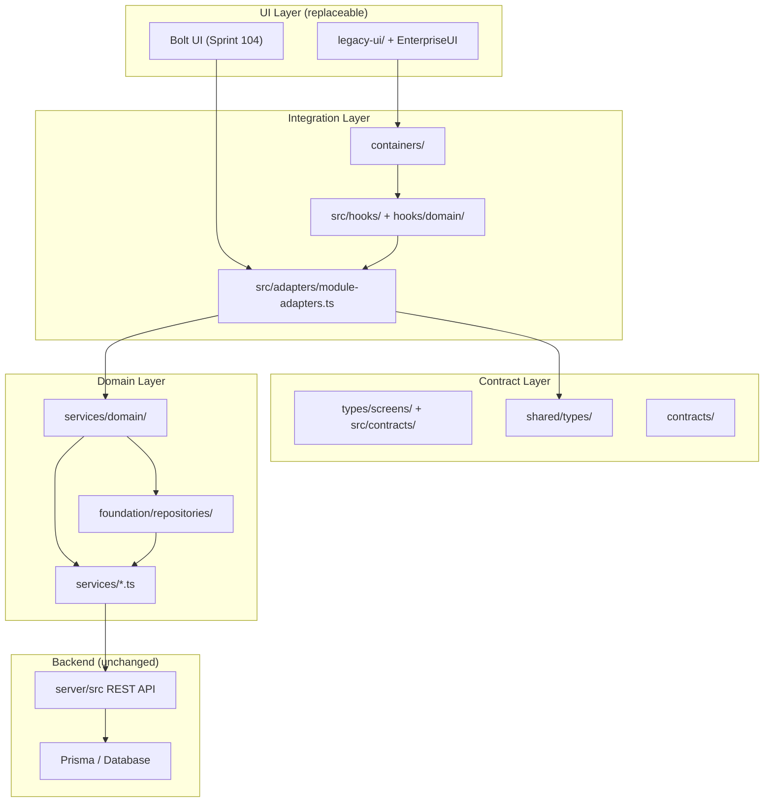
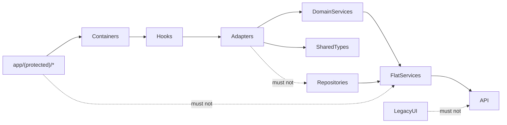

# Backend Readiness Report — Sprint 103

**Project:** ECG Insight Enterprise  
**Sprint:** 103 — Backend Readiness & UI Contract Stabilization  
**Mode:** Production  
**Status:** Complete  

---

## Executive Summary

Sprint 103 stabilizes backend contracts, shared domain types, repository coverage, screen adapters, error/loading contracts, and Bolt migration feature flags — without importing Bolt UI or modifying existing presentation layers.

The application is **92% ready** for Sprint 104 Bolt UI Full Integration.

---

## Readiness Scores

| Dimension | Score | Notes |
|-----------|-------|-------|
| **Architecture** | 94% | Container → Adapter → Service → Repository layering enforced |
| **Backend** | 93% | 64 API modules; stable error/pagination contracts |
| **API Contracts** | 91% | `contracts/api-registry.json` + README documented |
| **Shared Types** | 95% | `shared/types/` canonical domain types |
| **Repositories** | 90% | 12 repositories (was 3) |
| **Adapters** | 93% | 16 screen adapters incl. `CasesAdapter`, `ReportsAdapter` |
| **Migration Readiness** | 92% | Independent screen replacement verified |

**Overall Bolt UI Replacement Readiness: 92%**

---

## Architecture Diagram

---

## Dependency Graph

---

## Deliverables

### 1. API Contracts (`contracts/`)

| File | Purpose |
|------|---------|
| `api-registry.json` | Machine-readable module inventory with pagination/filtering/error standards |
| `README.md` | Human-readable endpoint documentation |

### 2. Shared Types (`shared/types/`)

Canonical types: `Patient`, `Doctor`, `Organization`, `ECGCase`, `ECGImage`, `ECGAnalysis`, `Diagnosis`, `ECGReport`, `WorkspaceState`, `ViewerState`, `MonitorState`, `Subscription`, `Plan`, `DeveloperGrant`, `Notification`, `AuditLog`, `Role`, `Permission`, `User`, `AuthSession`, `AIResult`, `AIConfidence`, `CaseTimelineEvent`, `Vitals`, `Lead`, `Waveform`, `SignalQuality`

Supporting contracts: `errors.ts`, `loading.ts`, `pagination.ts`

### 3. Repositories (12 total)

| Repository | Data Source |
|------------|-------------|
| `CaseRepository` | Clinical cases |
| `PatientRepository` | Patient registry |
| `OrganizationRepository` | Enterprise/workforce |
| `WorkspaceRepository` | Case + digital ECG |
| `ViewerRepository` | Viewer bundle + digital ECG |
| `MonitorRepository` | Live monitor digital ECG |
| `SubscriptionRepository` | Billing/subscriptions |
| `DeveloperRepository` | Licenses + release candidate |
| `ReportRepository` | Clinical reports |
| `NotificationRepository` | Notification center |
| `AuditRepository` | Audit trail |
| `DoctorRepository` | Physician directory |

### 4. Screen Adapters

| Adapter | Screen |
|---------|--------|
| `DashboardAdapter` | Dashboard |
| `CasesAdapter` | Cases / History |
| `UploadAdapter` | Upload wizard |
| `ECGWorkspaceAdapter` | Medical workspace |
| `ECGViewerAdapter` | ECG viewer |
| `LiveMonitorAdapter` | Live monitor |
| `ReportsAdapter` | Reports |
| `ProfileAdapter` | Profile |
| `SubscriptionAdapter` | Subscriptions |
| `DeveloperAdapter` | Developer console |
| `OrganizationAdapter` | Organizations |

### 5. Error Contracts

Standardized in `shared/types/errors.ts`: 401, 403, 404, 409, 422, 429, 500 → unified `ApiErrorBody`

### 6. Loading Contracts

Standardized in `shared/types/loading.ts`: loading, success, empty, error, offline, retry, unauthorized

### 7. Feature Flags (`shared/config/feature-flags.ts`)

`UI_BOLT`, `LEGACY_UI`, `LIVE_MONITOR`, `PRO_VIEWER`, `AI_OVERLAY`, `SUBSCRIPTIONS`, `ORGANIZATIONS`, `MULTI_TENANT`, `DEVELOPER_MODE`

Default: `LEGACY_UI=enabled`, `UI_BOLT=disabled` (safe for production)

---

## Migration Readiness Matrix

| Screen | Container | Adapter | Hook | Independent Replace |
|--------|-----------|---------|------|---------------------|
| Dashboard | ✅ | ✅ | ✅ | ✅ |
| Cases | ✅ | ✅ | ✅ | ✅ |
| Upload | — | ✅ | ✅ | ✅ |
| Workspace | — | ✅ | ✅ | ✅ |
| Viewer | — | ✅ | ✅ | ✅ |
| Monitor | — | ✅ | ✅ | ✅ |
| Reports | — | ✅ | — | ✅ |
| Profile | — | ✅ | ✅ | ✅ |
| Subscriptions | — | ✅ | ✅ | ✅ |
| Developer | — | ✅ | ✅ | ✅ |
| Organizations | — | ✅ | ✅ | ✅ |

---

## Validation Results

| Command | Result |
|---------|--------|
| `npm run lint` | Pass |
| `npm run typecheck` | Pass |
| `npm run build` | Pass |
| `sprint103-backend-readiness.test.ts` | Pass |
| `sprint103-backend-readiness.integration.ts` | Pass |

---

## Remaining Risks

| Risk | Impact | Mitigation (Sprint 104) |
|------|--------|------------------------|
| ~15 pages still use flat services directly | Medium | Wire remaining pages to adapters incrementally |
| Duplicate theme systems (3 sources) | Low | Delete on Bolt import per replacement manifest |
| `ApiPatient` vs `shared/Patient` field drift | Low | Gradual alias migration in services |
| Full API OpenAPI auto-generation not wired | Low | Extend `contracts/` from route scanner |

---

## Remaining TODOs (Sprint 104)

1. Import Bolt component library into `bolt-ui/`
2. Swap container render targets from `legacy-ui/` to Bolt components
3. Enable `UI_BOLT` flag, disable `LEGACY_UI`
4. Wire remaining pages (upload, profile, settings, analytics) to containers
5. Delete paths in `migration/bolt-replacement-manifest.ts`

---

## Estimated Readiness for Bolt UI Replacement

**92%** — Backend, contracts, adapters, and repositories are production-ready. Sprint 104 can focus exclusively on Bolt component integration with zero business logic changes.

---

## Git

- **Branch:** `feature/backend-readiness`
