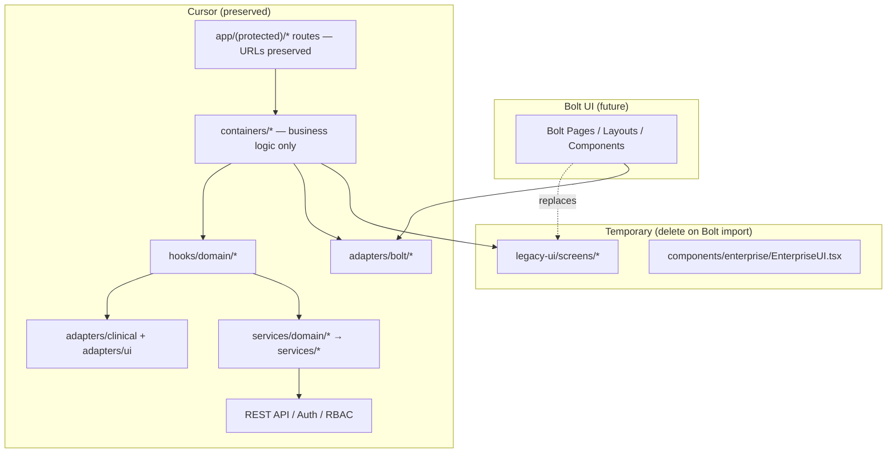

# Bolt UI Migration Foundation Report

**Project:** ECG Insight Enterprise  
**Sprint:** UI Migration Foundation (Bolt)  
**Mode:** Production  
**Status:** Complete  

---

## Executive Summary

The codebase is prepared as a **backend-first architecture** ready to receive the complete Bolt frontend. Bolt is the sole source of truth for UI/UX. Cursor retains backend, services, hooks, adapters, authentication, RBAC, and business logic.

No Bolt components were imported. No visual redesign occurred. Legacy presentation is isolated under `legacy-ui/` and listed in the replacement manifest for deletion upon Bolt import.

---

## Architecture

---

## Container → Presentation Pattern

| Route | Container | Presentation (legacy, Bolt replaces) | Screen Contract |
|-------|-----------|--------------------------------------|-----------------|
| `/dashboard` | `DashboardContainer` | `DashboardLegacyPresentation` | `DashboardScreenContract` |
| `/ecg-cases` | `EcgCasesContainer` | `EcgCasesLegacyPresentation` | `HistoryScreenContract` |

**Rules enforced:**
- Routes are thin delegates (`export { XContainer as default }`)
- Containers own hooks, mutations, navigation actions
- Presentation components receive typed `contract` props only
- No `useQuery`, `useMutation`, or `@/services/*` in `legacy-ui/`

---

## Bolt Adapter Layer

`adapters/bolt/bolt-ui.adapter.ts` maps hook results → strongly typed screen contracts:

| Method | Screen | Bolt import target |
|--------|--------|-------------------|
| `toDashboardContract` | Dashboard | Bolt Dashboard |
| `toHistoryContract` | ECG Cases / History | Bolt History |

---

## Screen Contracts (`types/screens/`)

Typed interfaces prepared for every Bolt screen:

| Contract | File |
|----------|------|
| Dashboard | `dashboard.ts` |
| History | `history.ts` |
| Workspace | `workspace.ts` |
| Viewer | `viewer.ts` |
| Live Monitor | `live-monitor.ts` |
| Patients | `patients.ts` |
| Organizations | `organizations.ts` |
| Profile | `profile.ts` |
| Subscription | `subscription.ts` |
| Developer Console | `developer-console.ts` |

---

## Replacement Manifest

`migration/bolt-replacement-manifest.ts` documents paths to **delete** when Bolt UI is imported (replace, do not merge):

- `components/enterprise/EnterpriseUI.tsx` — layout/navigation
- `legacy-ui/` — all temporary presentation
- Duplicate theme systems (`design-system/`, `presentation/tokens/`)
- Experimental viewer stacks (`render-engine-2/`, `live-monitor-v2/`, etc.)
- Duplicate route aliases (`patients/new.tsx`, `ecg-monitor/[caseId].tsx`)

**Preserved (never modify during Bolt import):** `server/`, `services/`, `hooks/domain/`, `adapters/`, `store/`, `AuthContext`, `routes/registry.ts`, `types/`.

---

## UI Ownership

| Bolt owns | Cursor owns |
|-----------|-------------|
| Pages, layouts, navigation, theme, forms, tables, charts, dialogs, medical workspace UI | Backend, database, auth, RBAC, API, state, hooks, services, validation, AI, payments |

---

## Validation Results

| Command | Result |
|---------|--------|
| `npm run lint` | Pass |
| `npm run typecheck` | Pass |
| `npm run build` | Pass |
| `bolt-ui-migration-foundation.test.ts` | Pass |
| `bolt-ui-migration-foundation.integration.ts` | Pass |
| `sprint102-frontend-foundation.integration.ts` | Pass |

**Pre-import checks verified:**
- No Tailwind/NativeWind conflicts
- Navigation centralized in `routes/registry.ts`
- No API calls in legacy presentation layer
- No duplicate nav href definitions in EnterpriseUI shell

---

## Bolt Import Sequence

1. Import Bolt component library into `bolt-ui/` (new folder)
2. For each screen contract in `types/screens/`, implement matching Bolt presentation component
3. Swap container render target: `LegacyPresentation` → `BoltPresentation`
4. Delete all paths in `BOLT_REPLACEMENT_MANIFEST`
5. Run validation suite — routes/URLs must remain unchanged

---

## Git

- **Branch:** `feature/bolt-ui-migration-foundation`

---

## Conclusion

The project is a clean backend-first platform waiting for Bolt UI. Routes, deep links, authentication, services, and business logic are preserved. Bolt components can be dropped in through the adapter layer without backend rewrites or routing conflicts.
