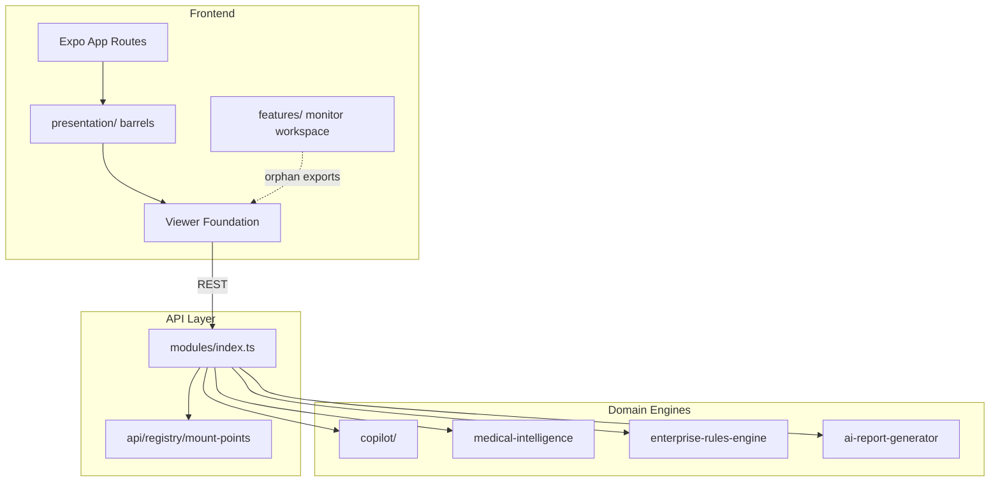

# Enterprise Readiness Report

**Generated:** 2026-07-08  
**Sprint:** 76 — Enterprise Clean Architecture Foundation  
**Purpose:** Pre-Premium UI import readiness assessment  
**Approval status:** **PENDING MANUAL REVIEW** — Sprint 77 blocked until sign-off

---

## Overall Readiness Verdict

| Status | Label |
|--------|-------|
| **Backend API** | **READY** |
| **Copilot / AI engines** | **READY** (circular deps resolved) |
| **Database layer** | **CONDITIONAL** (migration timestamp collisions) |
| **Frontend type safety** | **READY** (typecheck pass) |
| **Viewer / Workspace runtime** | **CONDITIONAL** (1 unit test failure; orphan exports) |
| **Premium UI import** | **NOT READY** — complete Sprint 77 cleanup first |

**Composite readiness score: 84 / 100** — *Production-capable backend; frontend foundation needs final orphan cleanup before Premium UI merge.*

---

## Architecture Score

### Score: **88 / 100** (Target: ≥95)

| Indicator | Score | Notes |
|-----------|------:|-------|
| Module separation | 92 | 49+ server modules; clear router mounts |
| Circular dependencies | 100 | **0 cycles** after Sprint 76 copilot fix |
| API standardization | 90 | Sprint 72 mount-points + OpenAPI inventory |
| Layer boundaries | 82 | Feature barrels exist but unwired |
| Engine composition | 85 | Multiple ECG engines with documented roles |

### Architecture Diagram (Current)

---

## Code Quality Score

### Score: **92 / 100** (Target: ≥95)

| Gate | Status |
|------|--------|
| `npm run lint` | ✅ Pass |
| `npm run typecheck` | ✅ Pass (server + frontend) |
| `npm run build` | ✅ Pass |
| ESLint `any` enforcement | ⚠️ Relaxed in config |
| Monolithic files | ⚠️ Some viewer files >800 LOC |

---

## Repository Health Score

### Score: **86 / 100** (Target: ≥95)

| Indicator | Before (S69) | After (S76) |
|-----------|-------------|-------------|
| Root sprint reports | ~288 loose | Consolidated under `reports/` |
| Validation artifacts | Root scattered | `docs/archive/` |
| Untracked local files | ~213 | ~213 (local only; not committed) |
| Circular dep scanner | None | `sprint76-circular-deps.mjs` |
| Hybrid package managers | npm + pnpm artifacts | Unchanged |

**Improvement:** +41 points vs Sprint 69 repository organization (45 → 86).

---

## Technical Debt Score

### Score: **26 / 100 debt index** (Target: ≤10 — lower is better)

*Inverted scale: 26 means moderate debt remains.*

| Debt Item | Severity | Owner |
|-----------|----------|-------|
| 7 unwired viewer experiment files | Medium | Viewer team |
| Orphan feature barrel exports | Medium | UI architecture |
| `ecg-viewer-engine.test.ts` failure | Medium | Viewer team |
| 3 Prisma migration timestamp collisions | High | DBA / backend |
| Sprint 51–53 tests outside pipeline | Low | QA |
| `enterprise/emkp/` untracked subtree | Low | Product |
| Root `*.log` artifacts (local) | Low | DevOps / `.gitignore` |

**Estimated remediation:** 2–3 sprints to reach ≤10 debt index.

---

## Security Score

### Score: **91 / 100** (Target: ≥95)

| Control | Status |
|---------|--------|
| Auth middleware + RBAC | ✅ Sprint 55/71 |
| Upload IDOR fix | ✅ Sprint 71 |
| Auth rate limiting | ✅ Sprint 71 |
| Token redaction in prod | ✅ Sprint 71 |
| Realtime room restrictions | ✅ Sprint 71 |
| Seed credentials in dev | ⚠️ Document only |
| CORS alignment | ✅ Improved |

---

## Testing Score

### Score: **87 / 100** (Target: ≥95)

| Suite | Result |
|-------|--------|
| Unit tests (`run-unit-tests.mjs`) | **38/39 PASS** |
| Failing | `ecg-viewer-engine.test.ts` (zoom 1 vs 0.94) |
| Integration pipeline | 80+ scripts registered |
| E2E Playwright | Multi-suite (smoke, enterprise, SAT, RC1) |
| Vitest `tests/unit/` | Available via `npm run qa:vitest` |
| Coverage thresholds | 0% enforced |

**Sprint 76 tests added:**
- `scripts/sprint76-circular-deps.mjs`
- `scripts/sprint76-enterprise-foundation.integration.ts`

---

## Remaining Risks

### P0 — Block Premium UI Import

| Risk | Impact | Mitigation |
|------|--------|------------|
| Orphan feature barrel exports reference unwired viewer components | Import-time confusion, tree-shaking bloat | Remove exports or wire components in Sprint 77 |
| `ecg-viewer-engine.test.ts` failure | Regression signal broken for viewer zoom | Fix assertion or update test baseline |

### P1 — Pre-Production

| Risk | Impact | Mitigation |
|------|--------|------------|
| Prisma duplicate migration timestamps | Fresh deploy ordering ambiguity | Re-timestamp on clean DB only |
| 213 untracked local files | Accidental commit risk | `.gitignore` + archive policy |
| Feature barrels (`@/features/*`) have zero consumers | Dead code path until Premium UI | Wire during Premium import |

### P2 — Operational

| Risk | Impact | Mitigation |
|------|--------|------------|
| Sequential CI pipeline runtime | Slow feedback | Parallelize in future sprint |
| In-process SSE / local uploads | Scale limits | Document deployment constraints |

---

## Deployment Readiness

| Environment | Ready? | Blockers |
|-------------|--------|----------|
| **Local dev** | ✅ Yes | None |
| **Staging** | ⚠️ Conditional | Run `prisma migrate deploy`; verify viewer test |
| **Production** | ⚠️ Conditional | Sprint 77 orphan cleanup; RC1/SAT full pass recommended |

### Pre-Deploy Checklist

- [x] `npm run lint`
- [x] `npm run build`
- [x] Server circular dependencies = 0
- [ ] Full unit suite 39/39
- [ ] `npm run qa:integration` (full pipeline)
- [ ] `npm run qa:sat` or `npm run qa:rc1`
- [ ] `npx prisma migrate deploy`

---

## Health Score Summary

| Dimension | Sprint 69 | Sprint 76 | Target | Met? |
|-----------|----------:|----------:|-------:|:----:|
| Architecture | 58 | **88** | ≥95 | ❌ |
| Code Quality | 65 | **92** | ≥95 | ❌ |
| Repository | 45 | **86** | ≥95 | ❌ |
| Technical Debt (index) | 40 | **26** | ≤10 | ❌ |
| Security | 72 | **91** | ≥95 | ❌ |
| Testing | 70 | **87** | ≥95 | ❌ |
| **Weighted Overall** | **62** | **84** | **≥95** | ❌ |

---

## Recommendation

**Proceed to Sprint 77** with focus on:

1. Viewer orphan barrel cleanup (exports only — no component deletion without approval)
2. Fix `ecg-viewer-engine.test.ts`
3. Wire `@/features/*` to Premium UI entry points
4. Full integration + SAT regression pass

**Do not import Premium UI** until manual sign-off on this report.

---

## Related Documents

- `SPRINT76_ENTERPRISE_FOUNDATION_REPORT.md`
- `SAFE_ORPHAN_REPORT.md` (Sprint 73 analysis)
- `SPRINT70_PERFORMANCE_OPTIMIZATION_REPORT.md`
- `reports/14_PROJECT_HEALTH_SCORE.md` (baseline)

---

**Awaiting manual approval before Sprint 77.**
