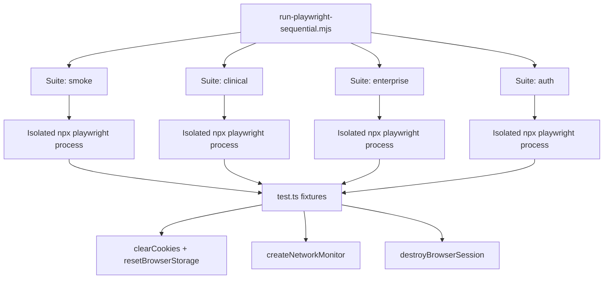

# Playwright Stabilization Report — Sprint 46.1

## Problem Statement

RC-1 and prior Playwright runs showed session recycling failures when:
- Multiple suites shared one API instance with parallel workers
- Browser cookies, localStorage, and IndexedDB leaked between tests
- Arbitrary `waitForTimeout` masked race conditions instead of waiting for stable UI

## Solution Architecture

## Configuration Changes

| Setting | Value | Rationale |
|---------|-------|-----------|
| `workers` | `1` | Single worker — shared API cannot tolerate parallel browser sessions |
| `fullyParallel` | `false` | Tests within file run sequentially |
| `retries` | `0` | Fail fast; infrastructure noise should not be masked by retries |
| `storageState` | `undefined` | No shared auth state file between tests |
| `trace` / `video` / `screenshot` | `retain-on-failure` | Artifacts on real failures only |

## Sequential Suites

| Suite | Specs | Required |
|-------|-------|----------|
| `smoke` | `@smoke` grep | Yes |
| `clinical` | clinical-workflows, workspace-restoration | Yes |
| `enterprise` | `@enterprise` grep | Yes |
| `auth` | auth-logout, login-screen, production-smoke | Yes |
| `sat` | SAT core specs (clinical + sprint36/37 + auth) | Yes (SAT only) |
| `mobile` | mobile-responsive @smoke | Optional |
| `accessibility` | accessibility @accessibility | Optional |
| `visual` | visual-regression-enterprise | Optional |

## Per-Test Lifecycle

1. `assertPlatformReady(request)` — API `/live` healthy
2. `context.clearCookies()`
3. `resetBrowserStorage(page)` — localStorage, sessionStorage, IndexedDB
4. Test body runs with `createNetworkMonitor(page)` attached
5. `network.assertStable(testInfo)` — fail on HTTP 5xx
6. `destroyBrowserSession(page, context)` — storage wipe + page close

## Entry Points Updated

- `npm run qa:smoke` → `--suite=smoke`
- `npm run qa:e2e` → default sequential (smoke + clinical + enterprise + auth)
- `npm run qa:sat` → lint/typecheck/build/integration + `--suite=sat`
- `npm run qa:regression` → full sequential runner
- `npm run qa:enterprise:full` → sequential + optional accessibility/visual
- GitHub Actions `playwright` job → sequential smoke + enterprise + matrix

## Expected Impact

- Eliminates cross-suite session contamination
- Reduces false failures from parallel API contention
- Produces per-suite `playwright-sequential-summary.json` for CI quality gates
