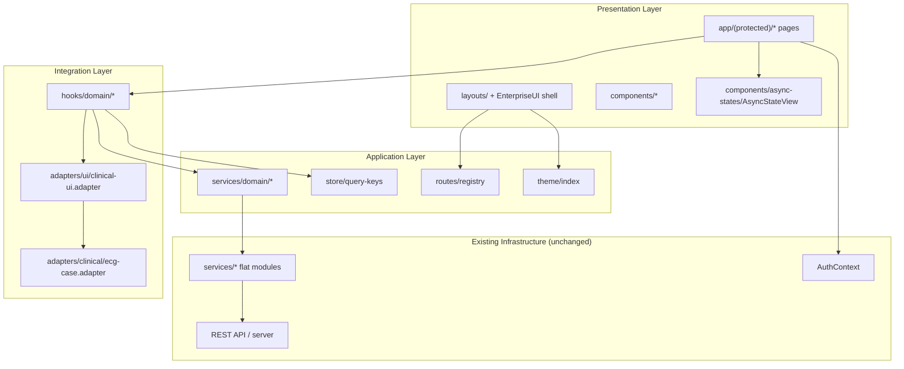
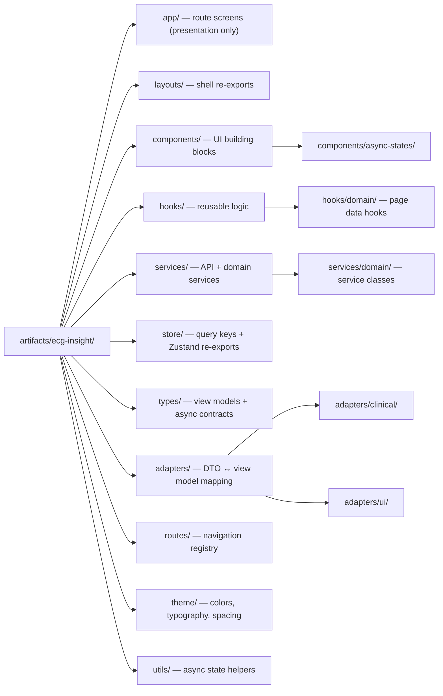
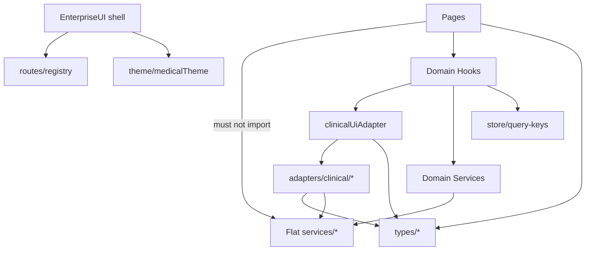

# Sprint 102 — Frontend Integration Foundation Report

**Project:** ECG Insight Enterprise  
**Sprint:** 102 — Frontend Integration Foundation  
**Mode:** Production  
**Status:** Complete  

---

## Executive Summary

Sprint 102 prepares the ECG Insight frontend for a future external React + TypeScript UI migration without changing visual layouts, replacing components, or touching backend APIs, authentication, AI engines, OCR, or medical business rules.

The work introduces a layered architecture—**types**, **adapters**, **domain services**, **hooks**, **stores**, **routes**, **theme**, and **async state utilities**—and refactors representative pages to consume data through hooks and services instead of inline API logic.

---

## Architecture Diagram

---

## Folder Structure Diagram

### New / Extended Paths

| Layer | Path | Responsibility |
|-------|------|----------------|
| Types | `types/async-state.ts`, `types/clinical.ts`, `types/navigation.ts` | View models, async status union, nav contracts |
| Adapters | `adapters/clinical/`, `adapters/ui/` | DTO mapping; UI isolation from backend services |
| Store | `store/query-keys.ts` | Centralized React Query cache keys |
| Routes | `routes/registry.ts` | `APP_NAV_ITEMS`, `APP_PAGE_TITLES`, `resolvePageMeta` |
| Theme | `theme/index.ts` | Unified theme barrel + `themeTokens` |
| Utils | `utils/asyncState.ts` | Loading / error / empty / permission / network resolution |
| Services | `services/domain/*` | Domain service classes wrapping existing flat services |
| Hooks | `hooks/domain/*` | Page-level data orchestration |
| Async UI | `components/async-states/AsyncStateView.tsx` | Standardized async presentation states |

---

## Dependency Diagram

**Dependency rules enforced in Sprint 102:**

1. Pages consume **hooks** and **presentation components** only.
2. Hooks orchestrate **domain services** and **UI adapters**.
3. Domain services delegate to existing **`@/services/*`** modules (no backend changes).
4. UI never receives raw Prisma/database shapes—only **view models** from adapters.
5. Navigation metadata lives in **`routes/registry.ts`**, not duplicated in shell components.

---

## Refactored Pages (Representative)

| Page | Hook / Service | Change |
|------|----------------|--------|
| `dashboard.tsx` | `useDashboardData` | Queries + snapshot mapping moved to hook |
| `ecg-cases/index.tsx` | `useEcgCasesPage` | List/filter/mutations centralized |
| `ecg-cases/[id].tsx` | `useEcgCaseDetail` | Case workflow mutations + `AsyncStateView` loading |
| `owner/licenses.tsx` | `useOwnerLicensesPage` | License CRUD via domain service |
| `reports/[id].tsx` | `reportsDomainService` | HTML/PDF/share web actions in service layer |
| `EnterpriseUI.tsx` | `@/routes` | Nav + page titles extracted to route registry |

Visual markup and layout structure on these screens were **not** redesigned.

---

## UI Adapter Layer

`adapters/ui/clinical-ui.adapter.ts` is the integration seam for external UI:

- **`mapCaseList` / `mapCaseDetail`** — clinical DTO → view model
- **`mapDashboardSnapshot`** — aggregates cases, patients, reports, notifications into a dashboard view model
- **`wrapQuery`** — optional query view normalization hook point

External components should depend on adapter outputs and domain hooks, not on `@/services/clinical` types directly.

---

## Standardized Async States

`utils/asyncState.ts` + `AsyncStateView` support:

| Status | Trigger |
|--------|---------|
| `loading` | Query in flight |
| `success` | Data available |
| `empty` | No records / null data |
| `error` | Generic failure |
| `permission-denied` | 403 / forbidden / unauthorized messages |
| `network-error` | Network / fetch / offline / timeout messages |

---

## Migration Readiness Report

| Criterion | Status | Notes |
|-----------|--------|-------|
| Layered folder structure | ✅ Ready | types, adapters, hooks, services, store, routes, theme, utils in place |
| API calls removed from refactored pages | ✅ Partial | 5 representative pages migrated; remaining pages still use flat services |
| Domain service classes | ✅ Ready | clinical, AI, reports, platform services |
| UI adapter layer | ✅ Ready | `clinicalUiAdapter` + clinical DTO mappers |
| Centralized query keys | ✅ Ready | `store/query-keys.ts` |
| Modular routing metadata | ✅ Ready | `routes/registry.ts`; shell imports registry |
| Theme centralization | ✅ Ready | `theme/index.ts` + existing `medicalTheme` |
| Async state standardization | ✅ Ready | `AsyncStateView` + `resolveAsyncStatus` |
| Backend / auth / medical logic untouched | ✅ Verified | No server, Prisma, or AI engine changes |
| Visual layout unchanged | ✅ Verified | Presentation-only refactors |
| Automated validation | ✅ Sprint tests | `sprint102-frontend-foundation.test.ts` + `.integration.ts` |

### Recommended Migration Sequence (Post–Sprint 102)

1. Drop external UI components into `components/` preserving props contracts aligned with view models in `types/clinical.ts`.
2. Wire each page to existing domain hooks; add hooks for unmigrated pages following `useDashboardData` pattern.
3. Route all new API access through `services/domain/*`.
4. Map backend responses exclusively through `adapters/clinical/*` before rendering.
5. Replace inline loading/error UI with `AsyncStateView` incrementally.

### Remaining Technical Debt (Out of Scope)

- ~20 additional protected pages still call `@/services/*` directly
- Some viewer/workspace modules contain embedded business logic (Sprint 99+ viewers intentionally untouched)
- Full React Query key migration from string literals to `queryKeys.*` is incomplete outside refactored pages

---

## Validation

| Command | Result |
|---------|--------|
| `npm run lint` | Pass |
| `npm run typecheck` | Pass |
| `npm run build` | Pass |
| `npm test` | Sprint 102 unit + integration pass; pre-existing unrelated failures may remain in legacy sprint suites |

### Sprint 102 Test Coverage

- **Unit:** `scripts/sprint102-frontend-foundation.test.ts` — adapters, async state, routes, query keys
- **Integration:** `scripts/sprint102-frontend-foundation.integration.ts` — file presence, page wiring, pipeline registration

---

## Git

- **Branch:** `feature/sprint102-frontend-foundation`
- **Commits:** `c789494` (foundation layers + page hooks), `0df63b7` (EnterpriseUI route registry wiring)

---

## Conclusion

Sprint 102 establishes a production-ready frontend integration foundation. The codebase now has clear separation between presentation, orchestration, services, and DTO mapping—enabling external UI components to be integrated with minimal churn while preserving existing clinical workflows and visual design.
