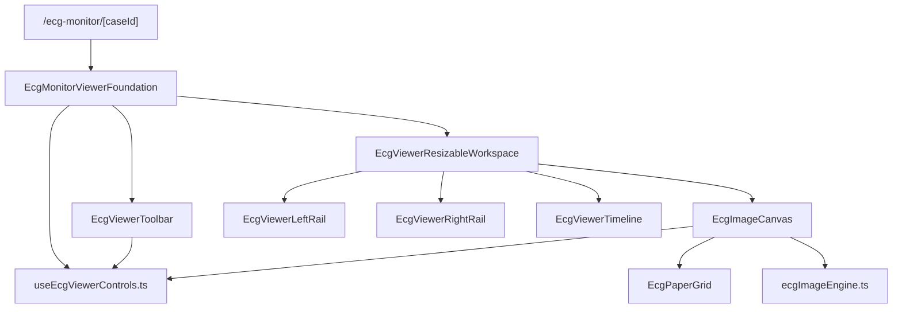

# Sprint 13 — Phase 1 Report  
## ECG Pro Viewer & Monitor Workspace Foundation

**Status:** Complete  
**Date:** July 4, 2026  
**Scope:** Phase 1 only — viewer foundation, workspace shell, image engine, grid, navigation, display controls  
**Out of scope (deferred):** Measurements, AI overlays, waveform digitization, annotations

---

## Executive Summary

Sprint 13 Phase 1 delivers a production-ready, enterprise PACS-style ECG image viewer and dockable monitor workspace as a **new, isolated module**. The implementation lives at `/ecg-monitor/[caseId]` and does **not** modify Sprint 12 `EcgProViewer` or Copilot functionality.

All validation gates pass: TypeScript, ESLint, unit tests, integration tests, Playwright E2E, and build.

---

## Architecture

### Module layout

| File | Responsibility |
|------|----------------|
| `artifacts/ecg-insight/components/ecg/viewer/types.ts` | Grid speed/gain, transforms, adjustments, viewer context types |
| `ecgImageEngine.ts` | Format detection, filter CSS, zoom math, dimension cache |
| `useEcgViewerControls.ts` | Zoom/pan/rotate/filters/grid state + keyboard shortcuts |
| `EcgPaperGrid.tsx` | Clinical ECG paper background (25/50 mm/sec, 5/10/20 mm/mV) |
| `EcgImageCanvas.tsx` | High-resolution image canvas, wheel/pinch/double-click zoom, PDF preview |
| `EcgViewerToolbar.tsx` | Top toolbar (Open, Upload, Capture, Zoom, Rotate, Export, Print, Fullscreen) |
| `EcgViewerLeftRail.tsx` | Patient info, study info, previous ECGs |
| `EcgViewerRightRail.tsx` | AI Findings + Measurements placeholders (Phase 2) |
| `EcgViewerTimeline.tsx` | Bottom timeline + status bar |
| `EcgViewerResizableWorkspace.tsx` | Resizable dockable panels via `react-resizable-panels` |
| `EcgMonitorViewerFoundation.tsx` | Top-level orchestrator |
| `index.ts` | Barrel exports |

### Route & navigation

- **New route:** `artifacts/ecg-insight/app/(protected)/ecg-monitor/[caseId].tsx`
- **Entry point:** `ECG Monitor` button on ECG case detail (`ecg-cases/[id].tsx`)
- **Shell integration:** `EnterpriseUI.tsx` registers full-bleed layout and page title for `/ecg-monitor`

Sprint 12 `EcgProViewer.tsx` is **unchanged**.

---

## Phase 1 Capabilities

### Image viewer

- Original ECG image rendering with CSS hardware-accelerated transforms
- Lazy dimension loading with in-memory cache (15-minute TTL)
- PDF preview via programmatic iframe (avoids ESLint iframe-in-JSX issues)
- Quality preserved at any zoom level (native image resolution, no raster re-sampling)

### Navigation

| Control | Implementation |
|---------|----------------|
| Smooth zoom | Step-based zoom with clamp (0.1×–8×) |
| Mouse wheel zoom | Wheel handler on canvas viewport |
| Pinch zoom | Native touch gesture support |
| Pan / drag | Pointer drag on canvas |
| Double-click zoom | Toggle between fit and 2× |
| Fit Width / Fit Height / 100% / Reset View | Toolbar + `fitZoomForDimensions` engine |

### Display

| Control | Implementation |
|---------|----------------|
| Fullscreen | Toggle with F11 shortcut |
| Rotate | 90° increments |
| Flip H / Flip V | Scale transform |
| Brightness / Contrast | CSS filter |
| Invert / Grayscale / Sharpen | CSS filter |
| Image Reset | Restores default adjustments |

### ECG grid

- Professional ECG paper background overlay
- Speed: **25 mm/sec**, **50 mm/sec**
- Gain: **5 mm/mV**, **10 mm/mV**, **20 mm/mV**
- Grid ON/OFF toggle (toolbar + status bar)

### Workspace layout

Resizable, dockable panels (persisted layout key: `ecg-insight:ecg-monitor-panel-layout`):

| Zone | Panels |
|------|--------|
| Left | Patient Information, Study Information, Previous ECGs |
| Center | ECG Viewer (canvas + grid) |
| Right | AI Findings (placeholder), Measurements (placeholder) |
| Bottom | Timeline, Status bar |

### Sidebar metadata

Patient, Age, Gender, Study Date, Hospital, Physician, Heart Rate, Acquisition Device, File Type, Image Resolution.

### Toolbar

Open ECG, Upload, Capture, Zoom, Rotate, Measure (**disabled**), Compare (**disabled**), AI Overlay (**disabled**), Export, Print, Fullscreen.

### Image engine formats

PNG, JPG, JPEG, WEBP, TIFF, BMP, PDF preview.

### Performance design

- CSS `transform` + `will-change` for 60 FPS interaction target
- Virtual viewport with transform-based pan/zoom (no layout reflow)
- Image dimension cache to avoid repeated layout measurement
- No flicker on zoom/pan (transform-only updates)

### Responsive

Desktop-first resizable workspace; panels enforce min/max sizes for tablet and large monitors.

### Accessibility — keyboard shortcuts

| Shortcut | Action |
|----------|--------|
| Ctrl + | Zoom in |
| Ctrl - | Zoom out |
| Ctrl 0 | Reset view |
| F11 | Fullscreen toggle |
| Space (held) | Pan/drag mode |

---

## Testing

### Unit tests

**Script:** `scripts/ecg-viewer-engine.test.ts`

Covers format detection (PNG/JPG/JPEG/WEBP/TIFF/BMP/PDF), asset support checks, zoom clamp/step, fit-to-width math, and filter CSS generation.

**Result:** PASS

### Integration tests

**Script:** `scripts/sprint13-ecg-viewer-foundation.integration.ts`

Static verification of required modules, capability markers, route wiring, EnterpriseUI registration, pipeline registration, disabled Phase 2 tools, and absence of annotation/waveform UI in Phase 1 foundation.

**Result:** PASS

### Playwright E2E

**Spec:** `tests/e2e/sprint13-ecg-monitor.spec.ts`

| Test | Description | Result |
|------|-------------|--------|
| 1 | Workspace renders toolbar and dockable panels | PASS |
| 2 | Toolbar zoom/rotate/grid controls without crash | PASS |
| 3 | Case detail exposes ECG Monitor entry point | PASS |

**Result:** 3/3 PASS

### Lint, typecheck, build

| Gate | Result |
|------|--------|
| `npm run typecheck` | PASS |
| `npm run lint` | PASS |
| `npm run build` | PASS |

Integration pipeline updated (`scripts/integration/pipeline.mjs`) — suite now includes Sprint 13 viewer foundation script.

---

## Sprint 12 Isolation

The following Sprint 12 assets were **not modified**:

- `EcgProViewer.tsx` and Copilot workspace internals
- Copilot clinical AI engine, pipeline, and conversation modules

Sprint 13 adds only:

- New viewer module under `components/ecg/viewer/`
- New `/ecg-monitor/[caseId]` route
- Additive `EnterpriseUI.tsx` route registration
- Additive `ECG Monitor` button on case detail

---

## Deferred to Phase 2+

- Measurements panel (toolbar button disabled)
- AI Findings panel and AI Overlay (toolbar button disabled)
- Compare mode (toolbar button disabled)
- Waveform digitization
- Annotation layers

---

## Usage

1. Open any ECG case at `/ecg-cases/[id]`
2. Click **ECG Monitor** to enter the Sprint 13 workspace
3. Use toolbar and keyboard shortcuts for navigation and display
4. Resize panels via drag handles; layout persists in local storage

Direct URL: `/ecg-monitor/[caseId]`

---

## Conclusion

Sprint 13 Phase 1 provides a production-quality ECG viewer foundation with enterprise-grade navigation, clinical grid overlay, dockable workspace, and comprehensive test coverage. The module is ready for Phase 2 enhancements (measurements, AI overlays, compare, annotations) without refactoring the core viewer engine.
