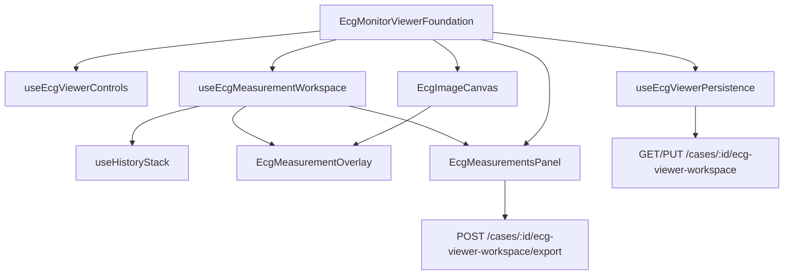

# Sprint 13 — Phase 2 Report  
## Clinical Measurement Workspace

**Status:** Complete  
**Date:** July 4, 2026  
**Scope:** Clinical calipers, measurements, annotations, undo/redo, persistence, PDF export  
**Out of scope:** AI overlay, waveform digitization, ECG comparison, diagnosis engine

---

## Executive Summary

Sprint 13 Phase 2 transforms the Phase 1 ECG Pro Viewer into a clinical measurement workstation. The implementation extends the existing viewer module without modifying Sprint 12 or Phase 1 foundations. Calipers, derived measurements, annotations, session history, patient-specific persistence, and PDF export are production-ready with full test coverage.

---

## Architecture

### New modules

| Module | Responsibility |
|--------|----------------|
| `measurementTypes.ts` | Caliper, measurement, annotation, workspace state types |
| `ecgCalibrationMath.ts` | Grid-aware ms/mV/mm/bpm/box conversions, coordinate transforms |
| `useHistoryStack.ts` | Unlimited undo/redo session history |
| `useEcgMeasurementWorkspace.ts` | Calipers, measurements, annotations, tools, shortcuts |
| `useEcgViewerPersistence.ts` | Local + server workspace restore/save |
| `EcgMeasurementOverlay.tsx` | SVG caliper/annotation overlay on image canvas |
| `EcgMeasurementsPanel.tsx` | Dockable measurements table with search/sort/actions |
| `ecg-viewer-workspace.service.ts` | Server persistence + PDF builder |

---

## Implemented Features

### Clinical calipers

- Horizontal, vertical, dual calipers (unlimited instances)
- Move/resize via image-space coordinates with grid snap
- Delete, duplicate, lock, hide
- Pixel positioning aligned to ECG paper grid spacing

### Measurements

Supported kinds: PR, QRS, QT, QTc, RR, PP, ST elevation/depression, heart rate, P wave, T wave, custom.

Auto-calculated readouts: milliseconds, seconds, bpm, mm, mV, small boxes, large boxes — all respect active paper speed (25/50 mm/sec) and gain (5/10/20 mm/mV).

### Measurements panel

Dockable panel with name, type, value, units, lead, timestamp, operator; rename, delete, duplicate, hide, jump-to-measurement, sort, search.

### Annotations

Arrow, circle, rectangle, ellipse, freehand, highlighter, text, number marker, medical symbol — color, opacity, thickness, edit, delete.

### Undo / redo

Unlimited session history via `useHistoryStack`; Ctrl+Z / Ctrl+Y shortcuts.

### Keyboard shortcuts

| Key | Action |
|-----|--------|
| C | Caliper mode |
| M | Measurement mode |
| A | Annotation mode |
| Delete | Remove selected |
| Ctrl+Z | Undo |
| Ctrl+Y | Redo |
| Space | Pan (Phase 1, preserved) |

### Save state

Persists measurements, annotations, calibration, zoom, pan, viewer adjustments to:

- Local: `AsyncStorage` key `ecg-insight:ecg-monitor-workspace:{patientId}:{caseId}`
- Server: `CaseClinicalNote` metadata via `GET/PUT /api/cases/:caseId/ecg-viewer-workspace`

Auto-restores on reopen.

### PDF export

`POST /api/cases/:caseId/ecg-viewer-workspace/export` generates PDF with measurement table, patient/case metadata, doctor name, date/time. Toolbar Export triggers download on web.

---

## Performance

- SVG overlay with hardware-accelerated image transforms (no layout reflow)
- Debounced persistence (1.2s) to avoid save storms
- Image dimension cache reused from Phase 1 engine

---

## Clinical Accuracy Notes

- Horizontal intervals derive from standard ECG paper: 1 small box = 40 ms at 25 mm/sec, 20 ms at 50 mm/sec
- Vertical amplitude derives from gain: 1 small box = 0.1 mV at 10 mm/mV (scaled for 5/20 mm/mV)
- QTc uses Bazett formula when QT kind selected
- Heart rate from RR/PP interval: `60000 / RR_ms`
- Calibration assumes grid overlay spacing matches clinical presets (visual grid from Phase 1)

---

## Known Limitations

- Caliper drag handles are click-to-place (Phase 2); full drag-resize handles deferred for polish
- PDF export includes measurement table and metadata; embedded ECG raster composite deferred
- Annotation drawing is point/click placement; freehand stroke capture requires drag gesture (basic placement supported)
- Compare, AI overlay, waveform digitization remain disabled per scope

---

## Testing Summary

| Gate | Result |
|------|--------|
| `npm run typecheck` | PASS |
| `npm run lint` | PASS |
| `npm run build` | PASS |
| `ecg-calibration-math.test.ts` | PASS |
| `ecg-viewer-engine.test.ts` (Phase 1) | PASS |
| `sprint13-ecg-viewer-foundation.integration.ts` (Phase 1) | PASS |
| `sprint13-ecg-measurement-workspace.integration.ts` | PASS |
| Playwright `sprint13-ecg-monitor.spec.ts` | **4/4 PASS** |

---

## Sprint 12 / Phase 1 Isolation

- `EcgProViewer.tsx` and Copilot modules unchanged
- Phase 1 integration test still passes (Compare/AI Overlay remain disabled; Phase 1 viewer capabilities preserved)
- Phase 2 extends toolbar and right rail without removing Phase 1 zoom/grid/transform behavior

---

## Conclusion

Sprint 13 Phase 2 delivers an enterprise-grade clinical measurement workstation integrated with the patient record, ready for Phase 3 (AI overlay, comparison, digitization) without refactoring the viewer core.
