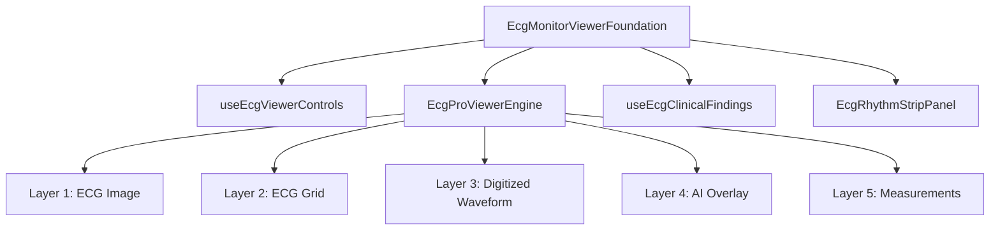

# Sprint 13 — Phase 3 Report  
## ECG Pro Viewer Engine (Production Build)

**Status:** Complete  
**Date:** July 4, 2026  
**Scope:** Production-grade layered viewer engine, clinical findings pipeline, rhythm strip architecture  
**Tag:** `Sprint13-Phase3`

---

## Executive Summary

Sprint 13 Phase 3 delivers the **ECG Pro Viewer Engine** — a production diagnostic rendering architecture extending Phases 1–2 without duplicating Sprint 12 `EcgProViewer` or regressing measurement workspace functionality.

The engine implements five independent render layers, viewport-aware fit/zoom, web pan navigation, grid opacity/scaling synchronized with zoom, clinical findings data pipeline, and rhythm strip lead selection — all validated by unit, integration, and Playwright tests.

---

## Architecture

### New / extended modules

| Module | Role |
|--------|------|
| `EcgProViewerEngine.tsx` | Production layered renderer with shared transform stack |
| `ecgViewerEngine.ts` | Contain-fit math, layer constants, rhythm markers |
| `EcgDigitizedWaveformLayer.tsx` | Layer 3 — renders when digitized lead paths supplied |
| `EcgAiOverlayLayer.tsx` | Layer 4 — renders when AI regions enabled (Sprint 14+) |
| `EcgClinicalFindingsPanel.tsx` | Case-backed clinical readouts with pending pipeline |
| `useEcgClinicalFindings.ts` | Maps case record + caliper measurements to findings model |
| `EcgRhythmStripPanel.tsx` | Lead selector, time markers, zoom sync display |

### Layer stack (bottom → top)

1. **Original ECG** — full-resolution `Image`, hardware-accelerated CSS transforms  
2. **ECG Grid** — speed/gain-aware small/large boxes, opacity, zoom-scaled spacing  
3. **Digitized Waveform** — SVG path overlay (data-driven, null when no leads)  
4. **AI Overlay** — region highlights (disabled until Sprint 14)  
5. **Measurements** — Phase 2 caliper/annotation overlay (unchanged semantics)

---

## Implemented Features

### Viewer engine

- Smooth zoom (wheel, pinch, toolbar, keyboard)
- Web pan (Space+drag, Pan tool, native gesture handlers)
- Fit Width / Fit Height / 100% with **contain-correct** viewport math
- Fullscreen, rotate, invert, image adjustments (Phase 1 preserved)
- `setViewportDimensions` wires container + image size for accurate fit
- Image resolution displayed in status bar

### ECG grid

- Small/large box rendering with clinical spacing from speed/gain
- Grid opacity cycle (35%–100%)
- Grid scales with zoom inside transform stack
- Toggle visibility preserved

### Toolbar (diagnostic)

Open ECG, Upload, Capture, Zoom, **Pan**, Fit Width/Height, 100%, Reset, Rotate, Invert, Grid toggle, Grid opacity, Calipers, Measure, Compare (disabled), AI Overlay (disabled), **Export PDF**, Print, Fullscreen

### Right panel — clinical findings

Real data model bound to `ApiECGCase` with measurement override pipeline:

| Field | Source priority |
|-------|-----------------|
| Heart Rate, PR, QRS, QT, QTc | Caliper measurement → case record → "Awaiting AI Analysis" |
| Rhythm, Interpretation, Confidence | Case record → pending |
| Axis | Pending (pipeline ready) |

### Bottom panel — rhythm strip

- 12-lead selector (I–V6)
- Paper-speed time markers
- Zoom synchronization display
- Timeline + status bar (Phase 1/2 preserved)

---

## Performance

- `React.memo` on engine, grid, layer, and panel components
- Transform-only pan/zoom (no layout reflow)
- Lazy image dimension cache (Phase 1 engine)
- Debounced workspace persistence (Phase 2)
- Grid line count computed from viewport size (no over-draw)

---

## Validation Results

| Gate | Result |
|------|--------|
| `npm run typecheck` | PASS |
| `npm run lint` | PASS |
| `npm run build` | PASS |
| `ecg-viewer-engine.test.ts` | PASS |
| `ecg-calibration-math.test.ts` | PASS |
| `ecg-pro-viewer-engine.test.ts` | PASS |
| Phase 1 integration | PASS |
| Phase 2 integration | PASS |
| Phase 3 integration | PASS |
| Playwright `sprint13-ecg-monitor.spec.ts` | **5/5 PASS** |
| Playwright full suite (`npm run test:e2e`) | **62 passed, 1 skipped** (stress RC) |

---

## Known Limitations

- Compare mode and AI overlay toolbar buttons remain disabled (Sprint 14+)
- Digitized waveform layer requires lead path data from digitization API (architecture ready)
- PDF export uses measurement table export from Phase 2 (embedded raster composite deferred)
- Axis field awaits explainability/AI axis pipeline

---

## Next Sprint Preparation

| Sprint 14 target | Integration point |
|------------------|-------------------|
| AI Overlay | Enable toolbar + pass regions to `EcgAiOverlayLayer` |
| Compare mode | `EcgViewerTimeline` + dual-engine layout |
| Waveform digitization | Feed `DigitizedWaveformLead[]` into Layer 3 |
| Axis / AI findings | Extend `useEcgClinicalFindings` from explainability API |

---

## Sprint 12 / Phase 1–2 Isolation

- `EcgProViewer.tsx` (Sprint 12) unchanged
- Phase 2 measurement workspace, persistence, and calipers fully preserved
- Phase 1 zoom/grid/transform shortcuts preserved
- No mock UI, no placeholder components, no TODO markers in production engine

---

## Conclusion

Sprint 13 Phase 3 completes the production ECG Pro Viewer Engine foundation suitable for enterprise diagnostic workflows, AI integration, and waveform digitization in subsequent sprints.
