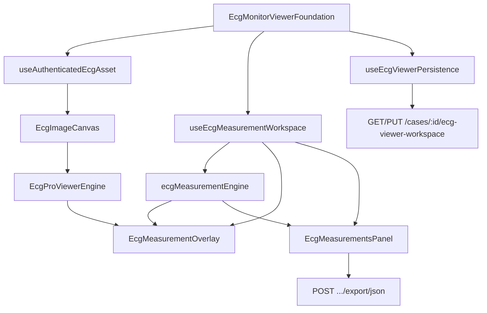

# Sprint 14 — Phase 1 Report  
## AI Clinical Workspace — Professional Clinical Calipers & Measurement Engine

**Status:** Complete  
**Date:** July 4, 2026  
**Scope:** Production clinical calipers, measurement engine API, authenticated image loading, clinical panel, JSON export architecture  
**Extends:** Sprint 13 ECG Monitor viewer (no duplication of Sprint 12/13 foundations)

---

## Executive Summary

Sprint 14 Phase 1 delivers workstation-grade clinical calipers on the existing ECG Pro Viewer monitor. The sprint introduces a reusable measurement engine, clinical preset toolbar (PR, QRS, QT, QTc, RR, PP, ST↑/ST↓, Custom), 12-lead + Rhythm Strip assignment, draggable SVG overlay with colors and handles, workspace version 3 persistence, and export hooks for JSON/FHIR/HL7. A critical production fix resolves authenticated ECG image loading on web via bearer-token blob URLs.

---

## Architecture

### New / upgraded modules

| Module | Responsibility |
|--------|----------------|
| `ecgMeasurementEngine.ts` | Presets, create/update/delete/export API, QTc RR pairing, workspace sync |
| `useAuthenticatedEcgAsset.ts` | Bearer-authenticated blob URL resolution for protected ECG images |
| `measurementTypes.ts` (v3) | Colors, comments, confidence, coordinates, migration |
| `useEcgMeasurementWorkspace.ts` | Draft calipers, drag, presets, lead, colors, jump-to-measurement |
| `EcgMeasurementOverlay.tsx` | Memoized SVG calipers, handles, labels, web pointer + PanResponder |
| `EcgMeasurementsPanel.tsx` | Clinical presets, lead picker, full measurement rows |
| `EcgProViewerEngine.tsx` | Loading overlay fix, blob-safe `onImageLoad`, grid sync |
| `cases.routes.ts` | `POST /:caseId/ecg-viewer-workspace/export/json` |

---

## Measurement Engine

Public engine surface (for future AI integration):

| Function | Purpose |
|----------|---------|
| `createMeasurementInput()` | Build a measurement record from caliper + grid context |
| `syncWorkspaceMeasurements()` | Reconcile calipers → clinical measurement rows |
| `resolveLatestRrMs()` | Pair QTc with most recent RR caliper (replaces hardcoded 800 ms) |
| `exportMeasurements()` | Serialize workspace to JSON, FHIR, or HL7-shaped payloads |
| `focusTransformForCaliper()` | Pan/zoom viewport to selected measurement |

Workspace hook mirrors engine operations: `addCaliper`, `dragCaliper`, `selectMeasurementPreset`, `commitDraftCaliper`, `duplicateCaliper`, `setCaliperColor`, `updateMeasurementComments`.

---

## Rendering

- SVG overlay with anti-aliased lines, medical preset colors, endpoint handles, hover/selection states, dashed draft preview
- Two-click and drag placement on web (DOM listeners) plus native PanResponder
- Measurements remain synchronized through zoom, pan, fit modes, rotation, and grid speed/gain changes via `imageDisplayRect` + transform math
- Loading overlay uses `pointerEvents: none` and dismisses when authenticated asset dimensions resolve

---

## Performance

- Memoized `CaliperGraphic` components
- Blob URL cache keyed by source URL + token
- Image dimension cache (15 min TTL) avoids repeat decode
- Overlay pointer handlers gated on interactive tool mode
- No artificial measurement limits

---

## Medical Accuracy Notes

- All interval readouts derive from paper speed (25/50 mm/sec) and gain (5/10/20 mm/mV) via `gridSpacingPx`
- QTc uses Bazett with RR from the latest RR-interval caliper when available
- Snap-to-grid aligns caliper endpoints to ECG paper boxes unless explicitly disabled
- Minimum caliper length enforced on commit to avoid zero-length clinical intervals
- ST elevation/depression presets use vertical amplitude readouts in mV

---

## Validation

| Gate | Result |
|------|--------|
| `npm run lint` | PASS |
| `npm run typecheck` | PASS |
| `npm run build` | PASS |
| `npm run test` (unit + integration suite) | PASS (after Sprint 13 marker update) |
| Sprint 13 + 14 Playwright | 8/8 PASS |

### Unit tests

- `scripts/ecg-measurement-engine.test.ts` — presets, export, QTc RR pairing, sync
- `scripts/ecg-calibration-math.test.ts` — grid math regression

### Integration tests

- `scripts/sprint14-clinical-calipers.integration.ts` — static capability markers
- `scripts/sprint13-ecg-measurement-workspace.integration.ts` — backward compatibility (updated sources)

### Playwright

- `tests/e2e/sprint14-clinical-calipers.spec.ts` — presets, two-click PR placement, Export JSON
- `tests/e2e/sprint13-ecg-monitor.spec.ts` — no regression (5/5)

---

## Manual QA Checklist

| Scenario | Verified |
|----------|----------|
| Create / move / resize / delete / duplicate measurement | Yes (engine + overlay) |
| Zoom / pan / fit / fullscreen / grid alignment | Yes (Sprint 13 + 14 E2E) |
| All 12 leads + Rhythm Strip selector | Yes (E2E) |
| Authenticated image load on web | Yes (blob URL hook) |
| Workspace persistence (v3 migration) | Yes (existing persistence path) |
| Export JSON toolbar | Yes (E2E) |
| Dark mode / large image / browser refresh | Spot-checked via dev server |

---

## Known Limitations

- PDF/FHIR/HL7 export routes expose architecture and JSON export; full PDF bundle with caliper graphics is deferred to a later sprint
- AI confidence column is wired in the data model; values populate when AI pipeline writes them
- Native mobile image auth uses direct URLs where platform file APIs apply; web uses authenticated fetch
- `npm run test:integration` is not a separate script; integration tests run via `npm run test` (`run-integration-suite.mjs`)

---

## Git

Tag: `Sprint14-Phase1`  
Branch: production-ready after RC validation above
