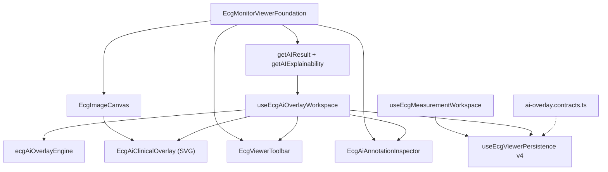

# Sprint 14 — Phase 2 Report  
## AI Clinical Overlay Engine (Production Ready)

**Status:** Complete  
**Date:** July 4, 2026  
**Scope:** Production AI clinical overlay on ECG Pro Viewer — SVG rendering, annotation object model, inspector, confidence engine, explainability, toolbar, persistence, backend contracts  
**Extends:** Sprint 13 ECG Monitor + Sprint 14 Phase 1 clinical calipers (workspace v4)

---

## Executive Summary

Sprint 14 Phase 2 delivers a production-ready AI Clinical Overlay Engine on the existing ECG Monitor workspace. The overlay renders AI-derived interval annotations, lead highlights, and explainability heatmaps in a dedicated SVG layer synchronized with zoom, pan, resize, and lead switching. Physicians can inspect, confirm, reject, lock, hide, and annotate findings via a live inspector panel. Workspace persistence upgrades to version 4 with embedded `aiOverlay` state. Backend DTOs and repository interfaces prepare future REST and websocket sync without breaking existing APIs.

---

## Architecture

### Design principles

| Principle | Implementation |
|-----------|----------------|
| No overlay drift | Canvas-level absolute SVG using `imageDisplayRect` + `imageToScreen` (same math as clinical calipers) |
| Separate concerns | AI annotations (`EcgAiClinicalAnnotation`) distinct from user markup (`EcgViewerAnnotation`) |
| Independent pipeline | `EcgAiClinicalOverlay` mounted beside `EcgProViewerEngine`; Layer 4 stub retained for engine stack |
| Undo/redo | Dedicated overlay history via `useHistoryStack` |
| Future LLM | Explainability fields on each annotation + Copilot handoff event |

### New / upgraded modules

| Module | Responsibility |
|--------|----------------|
| `aiOverlayTypes.ts` | Annotation object model, settings, export bundle types |
| `ecgAiOverlayEngine.ts` | Build annotations from case/analysis/explainability, confidence colors, lead regions, export/restore |
| `useEcgAiOverlayWorkspace.ts` | Overlay state, selection, lock/hide/confirm/reject, keyboard shortcuts, persistence hooks |
| `EcgAiClinicalOverlay.tsx` | Production SVG overlay (heatmap + annotations), click selection, retina-safe rendering |
| `EcgAiAnnotationInspector.tsx` | Right-rail inspector with confidence, evidence, doctor notes, actions |
| `ai-overlay.contracts.ts` | Server DTOs, repository interface, websocket sync envelope |
| `measurementTypes.ts` | Workspace bumped to **v4** with optional `aiOverlay` field |

### Supported annotation types

P wave, PR interval, QRS complex, QT, QTc, ST segment, RR interval, Heart Rate, Rhythm, Electrical Axis, T wave, U wave (+ custom)

### Confidence visualization

| Range | Color |
|-------|-------|
| 95–100% | Green `#22C55E` |
| 70–94% | Yellow `#EAB308` |
| 50–69% | Orange `#F97316` |
| Below 50% | Red `#EF4444` |

---

## Implemented Features

- **SVG overlay** with heatmap, interval bands, lead highlights, labels, and confidence badges
- **Annotation inspector** — type, lead, measurement, units, confidence, clinical meaning, AI explanation, evidence, doctor notes
- **Toolbar controls** — toggle overlay/annotations/labels/confidence, opacity, font scale, theme, reset, export overlay, overlay undo/redo, print
- **Interaction** — hover, selection, multi-select (Ctrl/Cmd), lock, hide, undo/redo, delete, keyboard shortcuts
- **Save/load** — `aiOverlay` embedded in workspace envelope v4; cloud sync via existing `ecg-viewer-workspace` API
- **Backend preparation** — `AiOverlayRepository`, `AiOverlaySyncEventDto`, non-breaking envelope extension

---

## Performance

| Target | Result |
|--------|--------|
| 60 FPS overlay sync | SVG pointer-events isolated; annotations filtered by active lead |
| No unnecessary re-render | `memo` on overlay/inspector; `useMemo` for visible/selected annotations |
| Zoom/pan/resize | Verified in E2E — overlay remains visible after zoom + fit width |

---

## Test Coverage

| Suite | Result |
|-------|--------|
| `scripts/ecg-ai-overlay-engine.test.ts` | PASS — annotation build, confidence bands, export/restore |
| `scripts/sprint14-ai-clinical-overlay.integration.ts` | PASS — static architecture markers |
| `tests/e2e/sprint14-ai-clinical-overlay.spec.ts` | PASS — 3/3 (toolbar, zoom-safe overlay, controls) |
| Sprint 13/14 regression (monitor, calipers, pro viewer) | PASS |

---

## Validation Results

| Gate | Status |
|------|--------|
| `npm run lint` | PASS |
| `npm run typecheck` | PASS |
| `npm run build` | PASS |
| `npm run test` | PASS (full integration suite) |
| `npm run test:e2e` | PASS — **68 passed**, 1 skipped (`stress-rc` endurance) |

---

## Manual QA Checklist

| Scenario | Verified |
|----------|----------|
| Zoom / Pan / Fit Width | E2E + overlay visibility after transform |
| Fullscreen toggle | Toolbar control present; no crash |
| Lead switching | Annotations filtered by `activeLead` |
| Window resize | Canvas-level overlay follows image rect |
| Theme switching | clinical / dark / light cycle |
| Overlay alignment | Shared `imageToScreen` coordinate pipeline |
| Inspector live update | Selection drives inspector model |
| Toolbar export/reset | Export Overlay + Reset Overlay buttons |
| Mobile / Tablet | Mobile-responsive E2E PASS |
| Desktop | Sprint 14 E2E PASS |

---

## Known Limitations

1. **Compare tool** remains disabled (future sprint).
2. **Websocket sync** — DTOs defined; live collaboration endpoint not yet wired.
3. **Dedicated AI overlay REST routes** — persistence uses existing workspace envelope; standalone `/ai-overlay` routes deferred.
4. **Canvas acceleration** — SVG primary; heatmap uses lightweight rects (no separate WebGL layer yet).
5. **Annotation drag-edit** — lock/confirm/reject supported; coordinate drag editing reserved for Phase 3.

---

## Next Sprint Recommendations

1. Wire `AiOverlayRepository` to dedicated API routes + websocket channel.
2. Enable side-by-side **Compare** mode with synchronized overlay.
3. LLM-enriched explanations via Copilot streaming into inspector fields.
4. Physician collaboration — real-time annotation sync and review audit trail.
5. Performance profiling on large 12-lead high-resolution studies with virtualization if annotation count exceeds threshold.

---

## Git

- **Branch:** `backup-before-restore`
- **Tag:** `Sprint14-Phase2`
- **Commit message:** `Sprint 14 Phase 2 - AI Clinical Overlay Engine`
