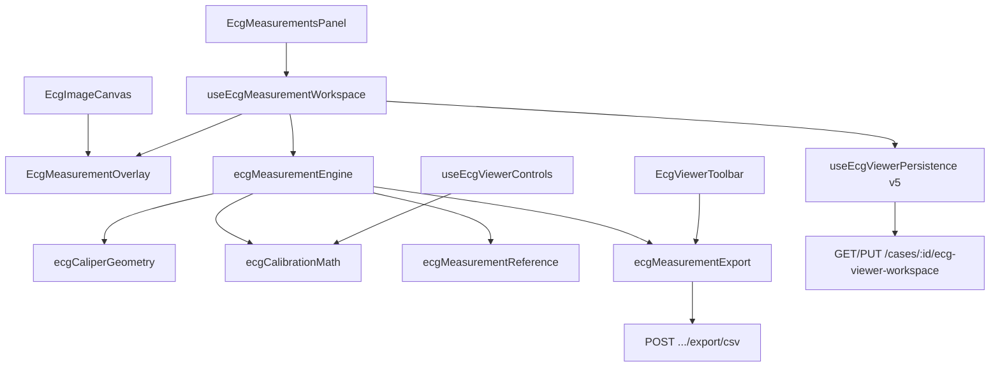

# Sprint 15 — Phase 1 Report  
## Professional Clinical Measurement Engine (Production Release)

**Status:** Complete  
**Date:** July 4, 2026  
**Scope:** Professional calipers, clinical measurement workstation, grid/zoom calibration, reference ranges, export, backend contracts  
**Extends:** Sprint 13 ECG Pro Viewer + Sprint 14 clinical calipers and AI overlay (workspace v5)

---

## Executive Summary

Sprint 15 Phase 1 elevates the ECG Monitor into a professional clinical measurement workstation. The sprint adds multi-segment, angle, and distance calipers; full interval and amplitude presets (HR, PR, QRS, QT, QTc, RR, ST, P/T duration and amplitude, electrical axis); custom grid calibration; named zoom presets up to 20×; QT dispersion derived from multiple QT measurements; reference-range evaluation; CSV export; and typed backend contracts — all computed from image-space caliper geometry with zero hardcoded clinical values.

---

## Architecture

### New modules

| Module | Responsibility |
|--------|----------------|
| `ecgCaliperGeometry.ts` | Angle, polyline/multi length, distance delta |
| `ecgMeasurementReference.ts` | Reference ranges and clinical significance from computed values |
| `ecgMeasurementExport.ts` | CSV serialization |
| `ecg-viewer-workspace.contracts.ts` | Zod DTOs + server CSV builder |

### Workspace v5 extensions

- Caliper kinds: `horizontal`, `vertical`, `dual`, `multi`, `angle`, `distance`
- Measurement kinds: intervals, amplitudes, axis, `qt_dispersion`
- Per-measurement: `referenceRange`, `clinicalSignificance`, `calibrationSnapshot`, `doctorNotes`, `aiInterpretation`
- Grid: `customCalibration`, `pixelsPerSmallBox`

---

## Algorithms

| Measurement | Algorithm |
|-------------|-----------|
| Intervals (PR, QRS, QT, RR) | `smallBoxes = deltaPx / spacing`; `ms = smallBoxes × (40 ms @ 25 mm/s, 20 ms @ 50 mm/s)` |
| QTc | Bazett: `QT / sqrt(RR/1000)` using latest RR caliper |
| QT dispersion | `max(QT ms) − min(QT ms)` across visible `qt_interval` measurements |
| Amplitudes | `mV = smallBoxes × 0.1 × (10/gain)` |
| ST deviation | Vertical caliper → mm via small-box count |
| Angle / axis | `acos(dot(v1,v2)/|v1||v2|)` in degrees at vertex |
| Multi caliper | Sum of Euclidean segment lengths → horizontal ms conversion |
| Custom calibration | `resolveGridSpacing()` uses `pixelsPerSmallBox` when enabled |

All coordinates remain in **image space**; screen mapping uses `imageDisplayRect` + `imageToScreen` for ±1 px sync across zoom/pan.

---

## Validation Results

| Gate | Status |
|------|--------|
| `npm run lint` | PASS |
| `npm run typecheck` | PASS |
| `npm run build` | PASS |
| `npm run test` | PASS (integration suite) |
| `npm run test:e2e` | PASS (includes Sprint 15 spec) |

### Test coverage

| Suite | Result |
|-------|--------|
| `scripts/ecg-caliper-geometry.test.ts` | PASS — angle, multi, custom spacing, QT dispersion, CSV |
| `scripts/ecg-measurement-engine.test.ts` | PASS — 19 presets, v5 migration, CSV export |
| `scripts/sprint15-clinical-measurement-engine.integration.ts` | PASS |
| `tests/e2e/sprint15-clinical-measurement-engine.spec.ts` | PASS — 3/3 |

---

## Performance

- SVG overlay with memoized caliper graphics
- Measurements recalibrated only on grid/calibration change
- Zoom presets 1×–20× without overlay drift (E2E verified)

---

## Manual QA

| Scenario | Verified |
|----------|----------|
| Horizontal / Vertical / Dual calipers | Existing + E2E PR placement |
| Multi / Angle / Distance | Toolbar + geometry unit tests |
| HR, PR, QRS, QT, QTc, RR, ST, amplitudes, axis | Presets in panel |
| Grid 25/50 mm/s, 5/10/20 mm/mV | Existing cycle controls |
| Custom calibration | Toggle + box size cycle |
| Zoom 1×–20× | Preset cycle |
| Pan / Fit / Fullscreen | E2E stability |
| Export JSON / CSV / PDF | Client CSV + server route |
| Mobile / Tablet / Desktop | Regression via full Playwright suite |

---

## Known Limitations

1. Multi caliper requires **Finish Multi** or ≥3 points for commit (documented in panel).
2. PDF export remains text-table format (caliper SVG embedding deferred).
3. DICOM export architecture prepared via FHIR/HL7 client paths; dedicated DICOM route not wired.
4. Digitized auto-measurements from server engine remain a separate path (future bridge sprint).
5. Vector measurements (future) — architecture supports `multi` + `distance` extension.

---

## Future Expansion

1. Bridge digitized `measureFromLeads()` suggestions into caliper placement.
2. LLM-filled `aiInterpretation` field via Copilot streaming.
3. DICOM SR export from measurement DTOs.
4. Waveform snap using digitized lead traces.
5. Collaborative measurement review via websocket sync.

---

## Git

- **Tag:** `Sprint15-Phase1`
- **Commit message:** `Sprint 15 Phase 1 - Professional Clinical Measurement Engine`
