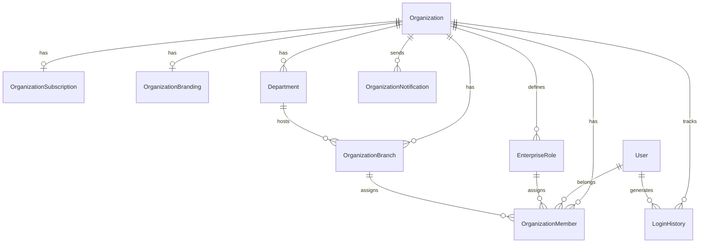

# Sprint 55 — Migration Report

## Migration

**ID:** `20260708010000_sprint55_enterprise_organization`  
**Status:** Applied successfully  
**Database:** PostgreSQL `ecg_insight`

## Changes

### Enum Extensions
- `OrganizationType` — +5 values (MEDICAL_CENTER, OCCUPATIONAL_HEALTH_CENTER, INSURANCE_PROVIDER, UNIVERSITY, RESEARCH_CENTER)
- `AuditAction` — +12 enterprise actions
- New: `EnterpriseNotificationCategory`, `EnterpriseRoleScope`, `DepartmentCategory`, `OrganizationMemberStatus`

### Organization Table
- Added: `brandColor`, `timezone`, `language`, `licenseNumber`, `taxNumber`, `storageQuotaMb`, `aiQuotaMonthly`, `version`, `deletedAt`
- Indexes: `deletedAt`, `(country, city)`

### Department Table
- Added: `category`, `description`, `deletedAt`

### New Tables (7)
1. `OrganizationBranch`
2. `OrganizationSubscription`
3. `OrganizationBranding`
4. `EnterpriseRole`
5. `OrganizationMember`
6. `LoginHistory`
7. `OrganizationNotification`

## ER Diagram



## Rollback

Drop new tables in reverse FK order; remove Organization/Department columns. Enum values cannot be removed without recreation.

## Verification

```
npx prisma migrate deploy  →  Applied successfully (52 migrations total)
npx prisma generate        →  Client regenerated
```
