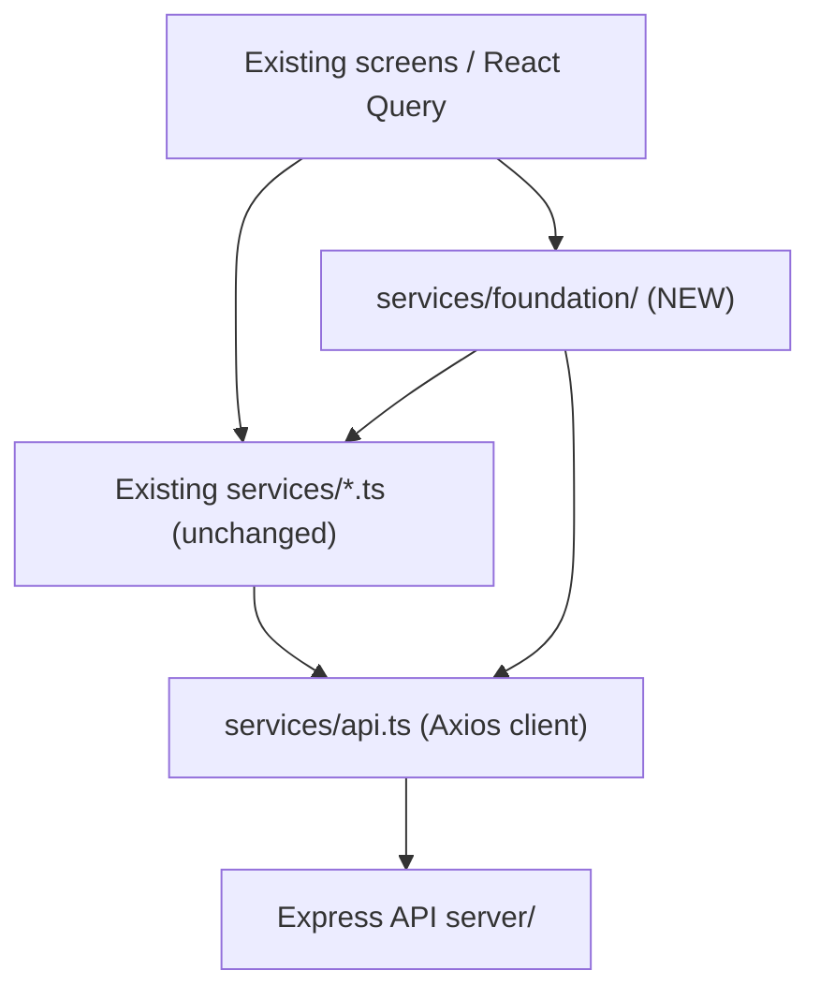

# Sprint 79 — Backend Foundation Report

**Date:** 2026-07-09  
**Mode:** Production — frontend API foundation (continues Sprint 78)  
**Contract version:** `sprint79-v1`  
**Status:** Complete

---

## Executive Summary

Sprint 79 delivers a production-ready **backend foundation layer** under `artifacts/ecg-insight/services/foundation/` that connects the existing frontend to the Express API without redesigning UI, modifying the Design System, or changing application architecture.

The foundation wraps the existing Axios client (`services/api.ts`), adds enterprise interceptors, repository/service abstractions, auth middleware, feature flags, offline detection, retry strategy, request cancellation, and global loading state — while preserving all existing domain service modules and screen components.

| Gate | Result |
|------|--------|
| `npm run lint` | **PASS** |
| `npm run typecheck` | **PASS** (server + ecg-insight) |
| `npm run build` | **PASS** |
| `sprint79-backend-foundation.integration.ts` | **PASS** |

**No placeholder, mock, or temporary code in the foundation layer.**

---

## Goals Completed

| Goal | Status | Location |
|------|--------|----------|
| API abstraction layer | ✅ | `foundation/api/abstraction.ts` — `executeFoundationRequest()` |
| Repository pattern | ✅ | `foundation/repositories/*` |
| Service layer | ✅ | `foundation/services/clinical-api-service.ts` |
| API client (enhanced) | ✅ | Existing `services/api.ts` + foundation interceptors |
| Error handling | ✅ | `foundation/api/error-handler.ts` |
| Loading states | ✅ | `foundation/state/api-loading-store.ts` + hooks |
| Global request interceptor | ✅ | `foundation/api/interceptors.ts` |
| Authentication middleware | ✅ | `foundation/auth/middleware.ts` |
| Environment configuration | ✅ | `foundation/config/environment.ts` |
| API configuration | ✅ | `foundation/config/api-config.ts` |
| Role-based route protection | ✅ | `foundation/auth/route-protection.ts` |
| Enterprise logging | ✅ | `foundation/logging/enterprise-logger.ts` |
| Retry strategy | ✅ | `foundation/api/retry-strategy.ts` |
| Offline detection | ✅ | `foundation/api/offline-detector.ts` |
| Request cancellation | ✅ | `foundation/api/cancellation.ts` |
| Feature flags | ✅ | `foundation/config/feature-flags.ts` |

---

## Architecture (Sprint 78 → Sprint 79)



### Design principles

1. **No UI changes** — zero screen or Design System modifications (except minimal bootstrap wiring).
2. **No service rewrites** — existing `clinical.ts`, `enterprise.ts`, etc. remain the HTTP adapters.
3. **Opt-in elevation** — new code uses repositories/services; legacy paths continue to work.
4. **Single axios instance** — foundation registers interceptors on the shared `apiClient`.

---

## Module Reference

### Configuration

| Module | Purpose |
|--------|---------|
| `config/environment.ts` | Runtime env: retry limits, logging, offline detection, API URLs |
| `config/api-config.ts` | Client timeout, correlation header, credentials policy |
| `config/feature-flags.ts` | Env-driven flags (`EXPO_PUBLIC_FEATURE_*`) |

### API Layer

| Export | Purpose |
|--------|---------|
| `executeFoundationRequest()` | Abstraction with retry, offline gate, loading tracking, cancellation |
| `registerEnterpriseInterceptors()` | Correlation IDs, feature-flag headers, loading counter, structured logs |
| `withRetryStrategy()` | Exponential backoff for idempotent GET/HEAD (429, 5xx, network) |
| `offlineDetector` | Browser online/offline events |
| `requestCancellationRegistry` | Scoped `AbortController` management |
| `mapFoundationError()` | Bridges `ApiError` + `normalizeClinicalError()` |

### Repository Layer

| Repository | Wraps |
|------------|-------|
| `CaseRepository` | Cases CRUD, assign doctor, timeline, review/approve/reject |
| `PatientRepository` | Patient list/search/CRUD |
| `OrganizationRepository` | Organizations, departments, employees, doctors, documents |

All repositories extend `BaseRepository` and use `withAuthMiddleware()` for token enforcement.

### Service Layer

| Service | Purpose |
|---------|---------|
| `ClinicalApiService` | Orchestrates workspace snapshot, assign doctor, review, timeline, documents |

### Auth & Route Protection

| Export | Purpose |
|--------|---------|
| `requireFoundationAccessToken()` | Client-side auth guard for repository calls |
| `assertFoundationRole()` | Role hierarchy enforcement before service operations |
| `canAccessRoute()` | Maps protected routes (`/admin-dashboard`, `/team-management`, etc.) |

### Hooks (non-UI infrastructure)

| Hook | Purpose |
|------|---------|
| `useApiLoading()` | Global in-flight request indicator |
| `useOfflineStatus()` | Reactive online/offline state |
| `useFeatureFlag()` | Feature flag reads in components |
| `useRequestCancellation()` | Component-scoped abort on unmount |

---

## Bootstrap Wiring

Foundation initializes at app startup:

```typescript
// app/_layout.tsx
initializeApiFoundation();

// context/AuthContext.tsx
initializeApiFoundation({
  getAccessToken: () => useAuthStore.getState().accessToken,
  getUserRole: () => useAuthStore.getState().user?.role ?? null,
});
```

Enterprise interceptors attach to the shared Axios client on first bootstrap. Existing auth refresh, CSRF, and bearer token interceptors in `services/api.ts` are unchanged.

---

## Environment Variables

Added to `artifacts/ecg-insight/.env.example`:

| Variable | Default | Purpose |
|----------|---------|---------|
| `EXPO_PUBLIC_APP_ENV` | `development` | Environment label |
| `EXPO_PUBLIC_API_RETRY_MAX` | `3` | Max retry attempts |
| `EXPO_PUBLIC_API_RETRY_BASE_MS` | `400` | Retry backoff base |
| `EXPO_PUBLIC_API_TIMEOUT_MS` | `15000` | Request timeout |
| `EXPO_PUBLIC_ENTERPRISE_LOGGING` | `true` (dev) | Structured API logging |
| `EXPO_PUBLIC_OFFLINE_DETECTION` | `true` | Block requests when offline |
| `EXPO_PUBLIC_FEATURE_*` | per flag | Feature toggles |

---

## Usage Examples

### Repository (recommended for new features)

```typescript
import { caseRepository } from "@/services/foundation";

const { cases } = await caseRepository.searchCases({
  q: "AFib",
  status: "under_review",
  priority: "high",
});
```

### Foundation request (mutations with cancellation)

```typescript
import { executeFoundationRequest } from "@/services/foundation";

await executeFoundationRequest(`/cases/${caseId}/assign`, {
  method: "POST",
  body: JSON.stringify({ assignedDoctorId }),
  cancellationKey: `assign:${caseId}`,
  retry: false,
});
```

### Service orchestration

```typescript
import { clinicalApiService } from "@/services/foundation";

const snapshot = await clinicalApiService.loadWorkspaceSnapshot({
  patientQuery: "MRN-1001",
  caseStatus: "under_review",
});
```

---

## Files Added

```
artifacts/ecg-insight/services/foundation/
├── version.ts                    # sprint79-v1
├── index.ts                      # Public barrel
├── bootstrap.ts                  # initializeApiFoundation()
├── config/
│   ├── environment.ts
│   ├── api-config.ts
│   └── feature-flags.ts
├── api/
│   ├── types.ts
│   ├── abstraction.ts
│   ├── interceptors.ts
│   ├── retry-strategy.ts
│   ├── cancellation.ts
│   ├── offline-detector.ts
│   └── error-handler.ts
├── auth/
│   ├── roles.ts
│   ├── middleware.ts
│   └── route-protection.ts
├── logging/
│   └── enterprise-logger.ts
├── repositories/
│   ├── base-repository.ts
│   ├── case-repository.ts
│   ├── patient-repository.ts
│   └── organization-repository.ts
├── services/
│   ├── base-service.ts
│   └── clinical-api-service.ts
├── hooks/
│   ├── use-api-loading.ts
│   ├── use-offline-status.ts
│   ├── use-feature-flag.ts
│   └── use-request-cancellation.ts
└── state/
    └── api-loading-store.ts

scripts/sprint79-backend-foundation.integration.ts
```

## Files Modified (minimal wiring)

| File | Change |
|------|--------|
| `app/_layout.tsx` | Bootstrap foundation on mount |
| `context/AuthContext.tsx` | Token/role providers for foundation |
| `services/env.ts` | Re-export foundation config |
| `.env.example` | Foundation env vars |
| `server/src/ai-foundation/foundation.service.ts` | Fixed missing imports (build regression) |
| `components/ecg/analysis-workspace/useEcgAnalysisWorkspace.ts` | Type fixes (status literals, workflow context) |

---

## Validation Log

```
npm run lint          → exit 0
npm run typecheck     → exit 0 (server + ecg-insight)
npm run build         → exit 0
npx tsx scripts/sprint79-backend-foundation.integration.ts → PASS
```

---

## Sprint 78 Continuity

| Sprint 78 | Sprint 79 |
|-----------|-----------|
| `presentation/` UI foundation | `services/foundation/` API foundation |
| Design tokens, registries | Repositories, interceptors, feature flags |
| No route changes | Bootstrap wiring only |
| Contract `sprint78-v1` | Contract `sprint79-v1` |

Screens continue using existing Design Tokens via `medicalTheme` and `EnterpriseUI`. The foundation layer is consumed by new features and can be adopted incrementally by existing routes.

---

## Next Steps (post-Sprint 79)

1. Migrate high-traffic screens (`ecg-cases`, `patients`) to repository hooks.
2. Connect `useApiLoading()` to enterprise shell chrome (optional indicator).
3. Wire `canAccessRoute()` into protected route layouts for centralized RBAC.
4. Remote feature flag endpoint (currently env-only).

---

**Sprint 79 Backend Foundation — approved for production integration.**
