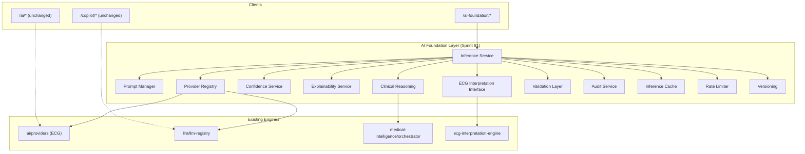

# Sprint 81 — AI Engine Foundation

**ECG Insight Enterprise**  
**Deliverable:** Unified backend AI integration layer  
**Version:** `81.0.0`  
**Module:** `server/src/ai-foundation/`

---

## Executive Summary

Sprint 81 introduces a **unified AI foundation layer** that consolidates fragmented inference stacks (ECG analysis, LLM/copilot, medical-intelligence, interpretation engine) behind a single orchestration surface. The layer adds cross-cutting capabilities — provider abstraction, prompt management, confidence scoring, medical validation, structured output, explainability, audit trail, versioning, caching, and rate limiting — without modifying UI, viewer, workspace, or rendering components.

Existing `/ai` and `/copilot` endpoints remain unchanged. New foundation APIs mount at `/ai-foundation`.

---

## Architecture Overview



---

## Module Structure

```
server/src/ai-foundation/
├── index.ts                      # Public exports
├── types.ts                      # Foundation DTOs
├── version.ts                    # Version tagging (81.0.0)
├── foundation.service.ts         # Health/status facade
├── foundation.routes.ts          # HTTP routes
├── foundation.schemas.ts         # Zod API schemas
├── providers/
│   ├── registry.ts               # Unified ECG + LLM provider registry
│   └── types.ts
├── prompts/
│   ├── catalog.ts                # Versioned prompt templates
│   ├── manager.ts                # Render + hash prompts
│   └── types.ts
├── inference/
│   └── service.ts                # Unified inference orchestrator
├── confidence/
│   └── service.ts                # ECG, LLM, clinical confidence
├── explainability/
│   └── service.ts                # Visual + evidence bundles
├── clinical-reasoning/
│   └── service.ts                # Medical-intelligence facade
├── ecg-interpretation/
│   └── interface.ts              # Interpretation model interface
├── validation/
│   ├── schemas.ts                # Structured Zod output schemas
│   ├── input-validator.ts        # Request validation
│   └── medical-validator.ts      # Clinical safety gates
├── audit/
│   └── service.ts                # AuditLog integration
├── cache/
│   └── inference-cache.ts        # In-memory TTL cache
└── rate-limit/
    └── service.ts                  # Per-actor inference quotas
```

---

## Components

### 1. AI Provider Abstraction

**Files:** `providers/registry.ts`, `providers/types.ts`

Unifies two previously separate interfaces:

| Stack | Legacy Interface | Foundation Handle |
|-------|------------------|-------------------|
| ECG case analysis | `AIProvider` (`ai/providers.ts`) | `getEcgProviderHandle()` |
| LLM / Copilot | `ILlmProvider` (`llm/llm-registry.ts`) | `getLlmProviderHandle()` |

`listProviderDescriptors()` returns capability metadata for health dashboards and routing decisions.

### 2. Prompt Manager

**Files:** `prompts/catalog.ts`, `prompts/manager.ts`

- Versioned prompt catalog (`clinical.system.v1`, `ecg.interpretation.v1`, etc.)
- Variable substitution (`{{heartRate}}`, `{{rhythm}}`, …)
- SHA-256 prompt hashing for audit reproducibility
- Reuses existing prompts from `ai/prompts/system.prompt.ts`

### 3. Inference Service

**File:** `inference/service.ts`

Single entry point: `runInference(request)`.

Pipeline per request:

1. Input validation
2. Rate limit check
3. Cache lookup (optional)
4. Provider dispatch by `kind`
5. Confidence + explainability enrichment
6. Medical validation
7. Cache store + audit record

Supported inference kinds:

| Kind | Backend | Output |
|------|---------|--------|
| `ecg_analysis` | `getAIProvider().analyze()` | `ECGAnalysisOutput` |
| `llm_chat` | `resolveLlmProvider().generateChat()` | `LlmCompletionDTO` |
| `clinical_reasoning` | `runMedicalIntelligenceEngine()` | `MedicalIntelligenceReport` |
| `ecg_interpretation` | `buildEnterpriseInterpretation()` | `EnterpriseEcgInterpretation` |

### 4. Confidence Scoring

**File:** `confidence/service.ts`

| Source | Function | Method |
|--------|----------|--------|
| ECG analysis | `scoreEcgAnalysisConfidence()` | Blends provider score, signal quality, evidence count |
| Clinical reasoning | `scoreClinicalReasoningConfidence()` | Delegates to medical-intelligence engine |
| LLM chat | `scoreLlmConfidence()` | Heuristic; caps on uncertainty language |

### 5. Medical Validation

**Files:** `validation/medical-validator.ts`, `validation/schemas.ts`

- Zod structured output schema for ECG results (`structuredEcgOutputSchema`)
- Clinical safety gates: critical severity requires urgent actions; low confidence + multiple abnormalities flags review
- `requiresPhysicianReview()` helper for workflow integration
- Medical-intelligence report structural validation

### 6. Structured Output

**File:** `validation/schemas.ts`

Zod schemas enforce typed, parseable AI outputs before persistence or downstream clinical use. ECG outputs must conform to diagnosis enum, confidence bounds, and required clinical fields.

### 7. ECG Interpretation Model Interface

**File:** `ecg-interpretation/interface.ts`

```typescript
interface EcgInterpretationModel {
  readonly version: string;
  interpret(input: EcgInterpretationModelInput): EnterpriseEcgInterpretation;
}
```

Default implementation: `EnterpriseEcgInterpretationModel` wrapping `ecg-interpretation-engine`.

### 8. Clinical Reasoning Layer

**File:** `clinical-reasoning/service.ts`

Facade over `medical-intelligence/orchestrator.ts`:

- Rule evaluation → confidence → explainability → differential → recommendations
- Optional prompt summary generation for LLM augmentation
- Returns validated `MedicalIntelligenceReport`

### 9. Explainability

**File:** `explainability/service.ts`

Merges two legacy formats:

| Source | Artifact |
|--------|----------|
| ECG AI (`ai/explainability.ts`) | Heatmap grid + lead highlights (visual) |
| Medical intelligence | Evidence-based rationale with conflicts/alternatives |

Output: unified `AiExplainabilityBundle` with `summary`, `visual`, and `evidence` sections.

### 10. Audit Trail

**File:** `audit/service.ts`

Records inference lifecycle events to `AuditLog` (mapped to existing Prisma `AuditAction` enum):

| Foundation Action | Prisma Action |
|-------------------|---------------|
| `AI_INFERENCE_STARTED` | `AI_ANALYSIS_QUEUED` |
| `AI_INFERENCE_COMPLETED` | `AI_ANALYSIS_COMPLETED` |
| `AI_INFERENCE_FAILED` | `AI_ANALYSIS_FAILED` |
| `AI_INFERENCE_RATE_LIMITED` | `SECURITY_EVENT_CREATED` |

Detailed foundation action stored in `metadata.aiAuditAction`.

### 11. Versioning

**File:** `version.ts`

Every inference result carries an `AiVersionTag`:

```json
{
  "foundationVersion": "81.0.0",
  "providerName": "rule_based",
  "modelVersion": "ecg-rule-v1",
  "engineVersion": "ecg-medical-intelligence-engine:1.0.0",
  "promptVersion": "clinical.reasoning.v1"
}
```

`formatVersionTag()` produces compact version strings for persistence.

### 12. Caching

**File:** `cache/inference-cache.ts`

- In-memory TTL cache (default 15 minutes, max 500 entries)
- Cache keys derived from case ID + measurement hash or explicit `cacheKey`
- Cache hits audited as `AI_INFERENCE_CACHED`

### 13. Rate Limiting

**File:** `rate-limit/service.ts`

- Per-actor, per-inference-kind sliding window (default: 30 requests / 60 seconds)
- Returns `429 AI_RATE_LIMITED` when exceeded
- Complements existing global `express-rate-limit` and subscription quotas

### 14. Validation

**Files:** `validation/input-validator.ts`, `foundation.schemas.ts`

- Request-kind validation before provider dispatch
- HTTP body validation via Zod middleware on foundation routes
- Combined structural + medical validation on outputs

---

## API Endpoints

Mounted at `/ai-foundation` (see `modules/index.ts`).

| Method | Path | Auth | Description |
|--------|------|------|-------------|
| `GET` | `/health` | Public | Provider health + foundation status |
| `GET` | `/status` | Required | Cache size, prompt count, version |
| `GET` | `/providers` | Required | Provider descriptors |
| `GET` | `/prompts` | Required | Prompt catalog |
| `POST` | `/prompts/render` | Required | Render prompt with variables |
| `POST` | `/inference` | Required | Run foundation inference |

---

## Integration Boundaries

### Unchanged (by design)

- `server/src/ai/ai.service.ts` — case-level `/ai/analyze` flow
- `server/src/llm/llm-client.ts` — Copilot streaming
- `server/src/modules/copilot/*` — clinical AI workspace
- All frontend UI components

### Recommended adoption path

1. **Phase 1 (Sprint 81):** Foundation module + routes + tests ✅
2. **Phase 2:** Route `ai.service.ts` through `runInference({ kind: "ecg_analysis" })`
3. **Phase 3:** Wire Copilot prompt rendering through `promptManager`
4. **Phase 4:** Persist `AiVersionTag` + explainability bundle on `AIAnalysis` / `ECGCase`

---

## Configuration

| Variable | Default | Purpose |
|----------|---------|---------|
| (in-memory) | TTL 15 min | Inference cache duration |
| (in-memory) | 30 req / 60s | Per-actor rate limit |
| `AI_PROVIDER` | `rule_based` | ECG provider selection (existing) |
| `LLM_MAX_CONCURRENT` | `1` | LLM queue concurrency (existing) |

---

## Testing

**Script:** `scripts/sprint81-ai-foundation.test.ts`  
**Pipeline:** Added to `scripts/integration/pipeline.mjs`

Coverage:

- Versioning and prompt catalog
- Prompt rendering and hashing
- Provider registry
- Foundation health/status
- Clinical reasoning pipeline
- ECG interpretation interface
- Confidence scoring + medical validation
- Rate limiting and caching
- Inference service (clinical reasoning path)

Run:

```bash
npx tsx scripts/sprint81-ai-foundation.test.ts
```

---

## Key Design Decisions

1. **Facade over rewrite** — Reuses proven engines; foundation adds orchestration, not replacement.
2. **No Prisma migration** — Audit actions map to existing enum; detailed actions in metadata.
3. **Incremental adoption** — Legacy endpoints untouched; foundation is opt-in.
4. **Backend only** — Zero UI/visual changes per sprint constraints.

---

## Files Added

| Path | Purpose |
|------|---------|
| `server/src/ai-foundation/**` | Foundation module (22 files) |
| `scripts/sprint81-ai-foundation.test.ts` | Validation tests |
| `SPRINT81_AI_FOUNDATION.md` | This document |

## Files Modified

| Path | Change |
|------|--------|
| `server/src/modules/index.ts` | Mount `/ai-foundation` router |
| `scripts/integration/pipeline.mjs` | Add Sprint 81 test |

---

## Validation Checklist

- [ ] `npm run typecheck` — server TypeScript
- [ ] `npx tsx scripts/sprint81-ai-foundation.test.ts`
- [ ] `GET /ai-foundation/health` returns provider status
- [ ] Clinical reasoning inference returns validated report
- [ ] Rate limit blocks excess requests per actor
- [ ] Audit events written when `actorId` present

---

*Sprint 81 — AI Engine Foundation — ECG Insight Enterprise*
