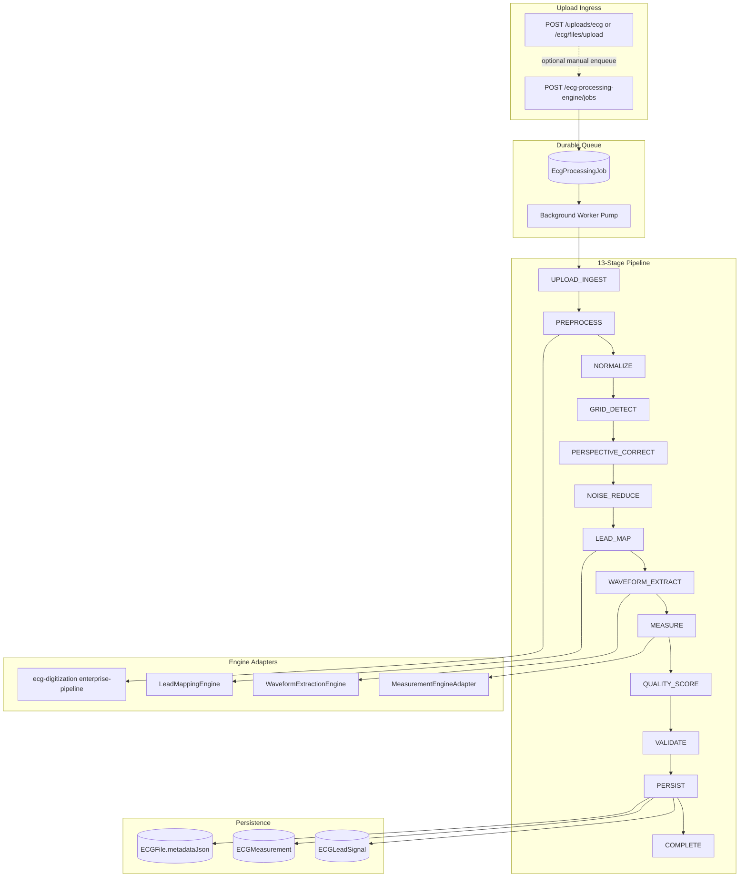

# Sprint 82 — ECG Processing Engine

**Version:** `sprint82-ecg-processing-v1`  
**Date:** 2026-07-09  
**API prefix:** `/api/ecg-processing-engine`

---

## Executive Summary

Sprint 82 delivers a **production ECG processing foundation** that unifies upload ingestion, image preprocessing, normalization, grid detection, perspective correction, noise reduction, waveform extraction, measurement, quality scoring, validation, persistence, and **durable background processing** with error recovery.

The engine wraps the existing `ecg-digitization-v47` enterprise pipeline and Sprint 59 measurement engine behind a **single orchestrated job model** persisted in PostgreSQL.

---

## Processing Architecture



---

## Module Layout

```
server/src/modules/ecg-processing-engine/
├── types.ts                    # Stages, progress, job DTOs
├── interfaces.ts               # Waveform / measurement / lead-mapping contracts
├── schemas.ts                  # Zod validation
├── stages.ts                   # Stage adapters over digitization primitives
├── orchestrator.ts             # 13-stage tracked execution
├── persist.ts                  # Lead + measurement + metadata persistence
├── repository.ts               # Prisma job CRUD + claim
├── worker.ts                   # Background pump (configurable concurrency)
├── recovery.ts                 # Exponential backoff + error classification
├── ecg-processing-engine.service.ts
├── ecg-processing-engine.routes.ts
└── index.ts
```

---

## Processing Stages

| Stage | Progress | Implementation |
|-------|---------:|----------------|
| `UPLOAD_INGEST` | 5% | Validate `ECGFile` storage path, MIME, case linkage |
| `PREPROCESS` | 12% | `decodeEcgImage` + `preprocessEcgImage` via enterprise pipeline |
| `NORMALIZE` | 18% | Gamma, histogram, adaptive brightness flags |
| `GRID_DETECT` | 28% | `detectGrid` calibration |
| `PERSPECTIVE_CORRECT` | 34% | Deskew + perspective correction metadata |
| `NOISE_REDUCE` | 40% | Background clean, shadow removal, edge sharpen |
| `LEAD_MAP` | 50% | `detectStandardLeadLayout` — 12-lead mapping |
| `WAVEFORM_EXTRACT` | 62% | Centerline extraction + signal reconstruction |
| `MEASURE` | 74% | Sprint 59 `runMeasurementEngine` |
| `QUALITY_SCORE` | 82% | `scoreImageQuality` + tier enrichment |
| `VALIDATE` | 88% | `validateDigitizedSignals` |
| `PERSIST` | 95% | `ECGLeadSignal` upsert, `ECGMeasurement`, case update |
| `COMPLETE` | 100% | Job result JSON + audit stage log |

---

## Engine Interfaces

### Waveform Extraction Interface

```typescript
interface WaveformExtractionEngine {
  extract(input: WaveformExtractionInput): WaveformExtractionResult;
}
```

Default adapter: `extractLeadWaveformCenterline` + `reconstructDigitizedLeads` + `buildDigitalSignalObjects`.

### Measurement Engine Interface

```typescript
interface MeasurementEngineAdapter {
  measure(input: MeasurementEngineInput): Promise<MeasurementEngineOutput>;
}
```

Default adapter: Sprint 59 `runMeasurementEngine` → diagnostic pipeline → validated DTO bundle.

### Lead Mapping Interface

```typescript
interface LeadMappingEngine {
  mapLeads(input: LeadMappingInput): LeadMappingResult;
}
```

Default adapter: `detectStandardLeadLayout` for standard 4×3 12-lead layout.

---

## Processing Queue

### Prisma Model: `EcgProcessingJob`

| Field | Purpose |
|-------|---------|
| `status` | `QUEUED`, `PROCESSING`, `COMPLETED`, `FAILED`, `CANCELLED`, `RETRY_SCHEDULED` |
| `stage` | Current `EcgProcessingStage` |
| `progress` | 0–100 mapped from `STAGE_PROGRESS` |
| `stageLog` | JSON array of per-stage timestamps + duration |
| `attemptCount` / `maxAttempts` | Retry governance (default 3) |
| `nextRetryAt` | Scheduled retry for recoverable failures |
| `resultJson` | Full `EcgProcessingJobResult` on success |
| `qualityScore` | Final digitization quality score |

**Migration:** `20260709010000_sprint82_ecg_processing_engine`

---

## Background Workers

- **Pump:** `ensureProcessingWorkerStarted()` — interval poll (default 1500ms)
- **Concurrency:** `ECG_PROCESSING_WORKER_CONCURRENCY` (default 2)
- **Claim:** Transactional `claimNextQueuedJob()` prevents double-processing
- **Dedup:** Active job per `(caseId, ecgFileId)` — returns existing queued job

---

## Error Recovery

| Error class | Recoverable? | Action |
|-------------|:------------:|--------|
| Digitization / quality / persistence | Yes | Exponential backoff retry (15s → 300s cap) |
| Resource not found / case mismatch | No | Mark `FAILED` permanently |
| Max attempts exceeded | No | `FAILED`; manual `POST /jobs/:id/retry?force=true` |

---

## API Endpoints

| Method | Path | Description |
|--------|------|-------------|
| `GET` | `/ecg-processing-engine/health` | Engine + worker stats |
| `POST` | `/ecg-processing-engine/jobs` | Enqueue case processing (202) |
| `GET` | `/ecg-processing-engine/jobs` | List jobs (filter by case/status) |
| `GET` | `/ecg-processing-engine/jobs/:jobId` | Job status + stage log |
| `POST` | `/ecg-processing-engine/jobs/:jobId/cancel` | Cancel queued/processing job |
| `POST` | `/ecg-processing-engine/jobs/:jobId/retry` | Schedule retry |
| `GET` | `/ecg-processing-engine/cases/:caseId/jobs` | Case job history |

### Enqueue Example

```http
POST /api/ecg-processing-engine/jobs
Authorization: Bearer <token>
Content-Type: application/json

{
  "caseId": "<ecg-case-uuid>",
  "ecgFileId": "<optional-file-uuid>",
  "maxAttempts": 3
}
```

---

## Relationship to Existing Modules

| Module | Role after Sprint 82 |
|--------|---------------------|
| `ecg-digitization` | Core image → waveform primitives (unchanged) |
| `ecg-processing` | Legacy HTTP routes remain for backward compatibility |
| `ecg-measurement-engine` | Canonical measurement via adapter |
| `ecg-diagnostic-pipeline` | Full clinical pipeline (AI, reports) — complementary |
| In-memory digitization jobs | Superseded by durable `EcgProcessingJob` for production |

---

## Validation

| Gate | Command |
|------|---------|
| Unit tests | `npx tsx scripts/sprint82-ecg-processing-engine.test.ts` |
| Integration markers | `npx tsx scripts/sprint82-ecg-processing-engine.integration.ts` |
| Server typecheck | `npx tsc -p server/tsconfig.json --noEmit` |
| Migration | `npx prisma migrate deploy` |

---

## Environment Variables

| Variable | Default | Purpose |
|----------|---------|---------|
| `ECG_PROCESSING_WORKER_CONCURRENCY` | `2` | Parallel job workers |
| `ECG_PROCESSING_WORKER_POLL_MS` | `1500` | Queue poll interval |
| `ECG_PROCESSING_RETRY_BASE_MS` | `15000` | Initial retry delay |
| `ECG_PROCESSING_RETRY_MAX_MS` | `300000` | Max retry delay cap |

---

## Preserved (Zero UI Changes)

- ECG Workspace, Viewer, Live Monitor, Rendering Engine, Canvas — **unchanged**
- Existing `/api/ecg/*` routes — **unchanged** (new engine is additive)

---

## Tag

`Sprint82_ECG_Processing_Engine`
