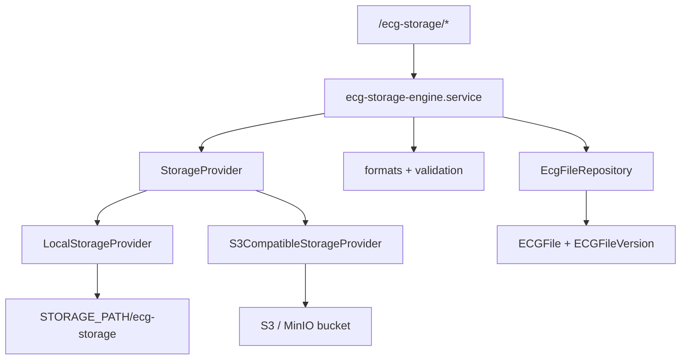

# Sprint 85 — ECG Storage Engine

**ECG Insight Enterprise**  
**Version:** `sprint85-ecg-storage-v1`  
**Continues from:** Sprint 82 ECG Processing Engine  
**Module:** `server/src/modules/ecg-storage-engine/`

---

## Executive Summary

Sprint 85 delivers a **production ECG file storage engine** that unifies ingest, retrieval, deletion, metadata, checksum integrity, versioning, and signed URL delivery behind a **storage provider abstraction** (local + S3-compatible). The engine is the recommended write path before Sprint 82 processing enqueue.

**No UI changes** — backend-only module mounted at `/ecg-storage`.

---

## Supported Formats

| Format | Extensions | MIME | File Type |
|--------|------------|------|-----------|
| PNG | `.png` | `image/png` | `IMAGE` |
| JPEG | `.jpg`, `.jpeg` | `image/jpeg` | `IMAGE` |
| PDF | `.pdf` | `application/pdf` | `PDF_REPORT` |
| DICOM (ready) | `.dcm`, `.dicom` | `application/dicom` | `DICOM_ECG` |

Magic-byte validation enforced on ingest.

---

## Architecture



---

## Module Structure

```
server/src/modules/ecg-storage-engine/
├── index.ts
├── types.ts
├── formats.ts
├── schemas.ts
├── repository.ts
├── ecg-storage-engine.service.ts
├── ecg-storage-engine.routes.ts
└── providers/
    ├── index.ts
    ├── local.provider.ts
    └── s3.provider.ts
```

---

## Features

### Upload
- `POST /ecg-storage/upload` (multipart `file`, `patientId`, optional `caseId`)
- SHA-256 checksum computed on ingest
- Deduplication by checksum (returns existing file if match)
- Version 1 recorded in `ECGFileVersion`

### Download
- `GET /ecg-storage/files/:ecgFileId/download` (auth, optional `?version=N`)
- `GET /ecg-storage/download?token=...` (signed URL, no session required)

### Delete
- `DELETE /ecg-storage/files/:ecgFileId` — soft delete + provider object removal

### Metadata
- `GET /ecg-storage/files/:ecgFileId/metadata` — file + version history

### Checksum
- Stored on `ECGFile.checksum`
- `GET /ecg-storage/files/:ecgFileId/checksum` — live verification

### Versioning
- `POST /ecg-storage/files/:ecgFileId/version` — append new blob, increment version
- `ECGFileVersion` table stores per-version checksum, key, path

### Storage Provider Abstraction

```typescript
interface StorageProvider {
  kind: "local" | "s3";
  put(input): Promise<StorageObjectRef>;
  getPath(key): Promise<string>;
  delete(key): Promise<void>;
  head(key): Promise<StorageHeadResult>;
}
```

| Provider | Config | Behavior |
|----------|--------|----------|
| **Local** | `STORAGE_PROVIDER=local` (default) | Files under `{STORAGE_PATH}/ecg-storage/ecg/{patientId}/` |
| **S3-compatible** | `STORAGE_PROVIDER=s3` + `S3_*` env | AWS SigV4 over fetch (MinIO/AWS). Falls back to local mirror when S3 not configured. |

### Signed URLs
- `POST /ecg-storage/files/:ecgFileId/signed-url` — mint HMAC token
- `GET /ecg-storage/download?token=` — token-based download (uses `verifySignedDownloadToken`)

---

## Schema Changes

**Migration:** `20260709030000_sprint85_ecg_storage_engine`

**ECGFile additions:**
- `checksum`, `storageProvider`, `storageKey`, `version`, `recordUuid`, `deletedAt`

**New model:** `ECGFileVersion`

---

## Configuration

| Variable | Default | Purpose |
|----------|---------|---------|
| `STORAGE_PATH` | `uploads` | Local storage root |
| `STORAGE_PROVIDER` | `local` | `local` or `s3` |
| `ECG_STORAGE_MAX_BYTES` | `52428800` | 50 MB upload limit |
| `S3_ENDPOINT` | — | S3/MinIO endpoint URL |
| `S3_BUCKET` | — | Bucket name |
| `S3_ACCESS_KEY` | — | Access key |
| `S3_SECRET_KEY` | — | Secret key |
| `S3_REGION` | `us-east-1` | AWS region |

---

## Sprint 82 Integration

Sprint 82 `UPLOAD_INGEST` reads `ECGFile.storagePath`. Files uploaded via `/ecg-storage/upload` populate `storagePath`, `storageKey`, and `checksum` — compatible with processing engine enqueue.

Recommended flow:
1. Upload via `/ecg-storage/upload`
2. Enqueue processing via `/ecg-processing-engine` with returned `file.id`

---

## API Endpoints

| Method | Path | Auth | Description |
|--------|------|------|-------------|
| `GET` | `/ecg-storage/health` | Public | Engine status |
| `GET` | `/ecg-storage/download` | Token | Signed download |
| `POST` | `/ecg-storage/upload` | Doctor | Upload ECG file |
| `GET` | `/ecg-storage/files/:id/metadata` | Auth | Metadata + versions |
| `GET` | `/ecg-storage/files/:id/download` | Auth | Authenticated download |
| `POST` | `/ecg-storage/files/:id/signed-url` | Auth | Mint signed URL |
| `POST` | `/ecg-storage/files/:id/version` | Doctor | Upload new version |
| `GET` | `/ecg-storage/files/:id/checksum` | Auth | Verify checksum |
| `DELETE` | `/ecg-storage/files/:id` | Doctor | Soft delete |

---

## Testing

```bash
npx tsx scripts/sprint85-ecg-storage-engine.test.ts
npx tsx scripts/sprint85-ecg-storage-engine.integration.ts
```

Pipeline entries added to `scripts/integration/pipeline.mjs`.

---

## Validation Checklist

- [ ] `npm run lint`
- [ ] `npm run typecheck`
- [ ] `npm run build`
- [ ] Unit tests pass
- [ ] Integration markers pass
- [ ] `GET /ecg-storage/health` returns engine version
- [ ] Upload PNG → metadata includes checksum + version 1
- [ ] Signed URL round-trip downloads file

---

*Sprint 85 — ECG Storage Engine — ECG Insight Enterprise*
