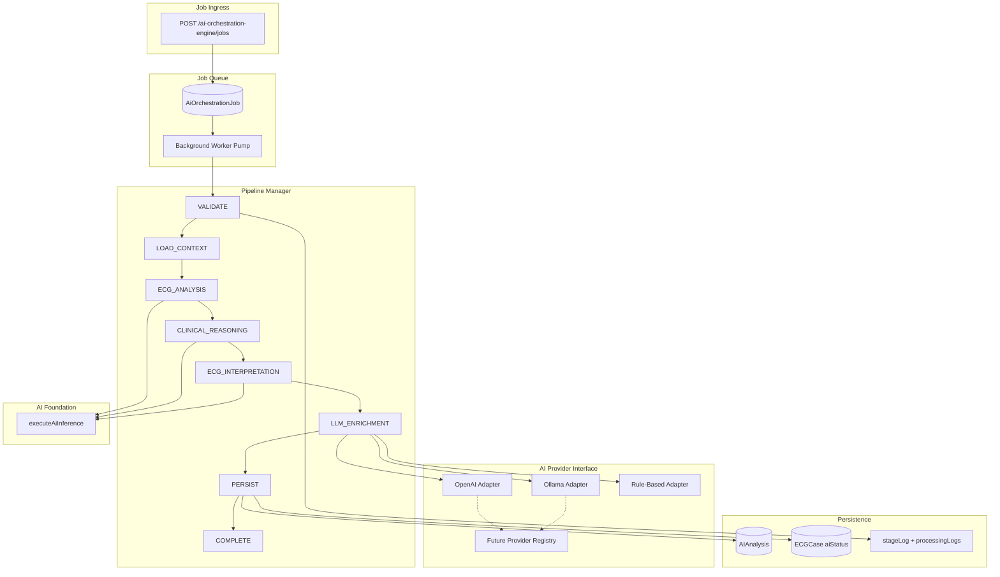

# Sprint 86 — AI Orchestration Engine

**Version:** `sprint86-ai-orchestration-v1`  
**Date:** 2026-07-09  
**API prefix:** `/api/ai-orchestration-engine`

---

## Executive Summary

Sprint 86 delivers a **durable AI processing orchestrator** that supersedes the legacy in-memory `queueAnalysis()` path with a PostgreSQL-backed job queue, tracked multi-stage pipeline, retry engine, timeout handling, provider adapters (OpenAI, Ollama, rule-based), processing logs, and REST job status APIs.

The engine integrates with **AI Foundation** (`executeAiInference`) for ECG analysis, clinical reasoning, and interpretation stages, while routing LLM enrichment through pluggable provider adapters.

---

## Orchestration Architecture



---

## Module Layout

```
server/src/modules/ai-orchestration-engine/
├── types.ts                         # Stages, progress, job DTOs
├── schemas.ts                       # Zod validation for REST API
├── recovery.ts                      # Retry engine + timeout handling
├── repository.ts                    # Prisma job queue CRUD + claim
├── pipeline-manager.ts              # Pipeline Manager (tracked stages)
├── persist.ts                       # AIAnalysis + case persistence
├── measurement-adapter.ts           # Prisma measurement → clinical DTO
├── worker.ts                        # Background job pump + concurrency
├── ai-orchestration-engine.service.ts
├── ai-orchestration-engine.routes.ts
├── providers/
│   ├── ai-provider.interface.ts     # AI Provider Interface
│   ├── openai.adapter.ts            # OpenAI Adapter
│   ├── ollama.adapter.ts            # Ollama Adapter
│   └── registry.ts                  # Provider resolution + future registry
└── index.ts
```

---

## Job Queue

| Capability | Implementation |
|------------|----------------|
| Durable queue | `AiOrchestrationJob` Prisma model |
| Dedup active jobs | `createOrchestrationJob` skips duplicate QUEUED/PROCESSING per case |
| Atomic claim | `claimNextOrchestrationJob` transaction |
| Concurrency | `AI_ORCHESTRATION_WORKER_CONCURRENCY` (default 2) |
| Poll interval | `AI_ORCHESTRATION_WORKER_POLL_MS` (default 2000ms) |

---

## Pipeline Manager

Eight tracked stages with progress percentages and `stageLog` entries (duration, status, timestamp).

| Stage | Progress | Description |
|-------|----------|-------------|
| VALIDATE | 5% | Case existence check |
| LOAD_CONTEXT | 15% | Create/link `AIAnalysis` record |
| ECG_ANALYSIS | 30% | AI Foundation `ecg_analysis` |
| CLINICAL_REASONING | 45% | AI Foundation `clinical_reasoning` |
| ECG_INTERPRETATION | 60% | AI Foundation `ecg_interpretation` |
| LLM_ENRICHMENT | 75% | Provider adapter chat enrichment |
| PERSIST | 90% | Update `AIAnalysis` + case `aiStatus` |
| COMPLETE | 100% | Finalize job result JSON |

Pipeline kinds: `FULL`, `ECG_ONLY`, `LLM_ONLY`.

---

## Retry Engine

- Exponential backoff: `AI_ORCHESTRATION_RETRY_BASE_MS` (20s) → max `AI_ORCHESTRATION_RETRY_MAX_MS` (600s)
- Recoverable errors: provider failures, rate limits, timeouts
- Non-recoverable: not found, case mismatch, cancelled
- Status: `RETRY_SCHEDULED` with `nextRetryAt`

---

## Timeout Handling

- Per-job `timeoutMs` (default 300s, max 900s via API)
- `withOrchestrationTimeout` wraps full pipeline execution
- Timeout status: `TIMED_OUT` with `timedOutAt` timestamp
- Error code: `PIPELINE_TIMEOUT`

---

## Processing Logs

- `processingLogs`: structured debug/info/warn/error messages appended during pipeline execution
- `GET /jobs/:jobId/logs` returns both `processingLogs` and `stageLog`

---

## Progress Tracking

- `progress` field updated per stage via `ORCHESTRATION_STAGE_PROGRESS`
- `stageLog`: per-stage completion/failure/skip/timed_out entries
- `processingLogs`: structured debug/info/warn/error messages

---

## AI Provider Interface

`IAiOrchestrationProvider` exposes `generateChat`, `healthCheck`, `name`, `model`, `kind`.

| Adapter | Kind | Source |
|---------|------|--------|
| OpenAiOrchestrationAdapter | openai | `OpenAiCompatibleProvider` |
| OllamaOrchestrationAdapter | ollama | `OllamaProvider` |
| RuleBasedOrchestrationAdapter | rule_based | No LLM enrichment |
| MockOrchestrationAdapter | mock | Test / `COPILOT_LLM_MOCK` |

`registerFutureAiProvider()` enables future provider registration without schema changes.

---

## Job Status API

| Method | Path | Description |
|--------|------|-------------|
| GET | `/health` | Engine + worker stats |
| POST | `/jobs` | Enqueue orchestration job (202) |
| GET | `/jobs` | List jobs (filter by case/status) |
| GET | `/jobs/:jobId` | Job status + result |
| GET | `/jobs/:jobId/logs` | Processing + stage logs |
| POST | `/jobs/:jobId/cancel` | Cancel queued/processing job |
| POST | `/jobs/:jobId/retry` | Retry failed/timed-out job |
| GET | `/cases/:caseId/jobs` | Case-scoped job list |

---

## Repository Layer

Prisma model `AiOrchestrationJob` with enums:
- `AiOrchestrationJobStatus` (includes `TIMED_OUT`)
- `AiOrchestrationStage`
- `AiProviderPreference`
- `AiOrchestrationPipelineKind`

Migration: `20260709020000_sprint86_ai_orchestration_engine`

---

## Tests

| Script | Type |
|--------|------|
| `scripts/sprint86-ai-orchestration-engine.test.ts` | Unit |
| `scripts/sprint86-ai-orchestration-engine.integration.ts` | Integration markers |

---

## Validation

```bash
npm run lint
npm run typecheck
npm run build
npx tsx scripts/sprint86-ai-orchestration-engine.test.ts
npx tsx scripts/sprint86-ai-orchestration-engine.integration.ts
```

---

## Continuation from Sprint 82

Sprint 82 established the **ECG signal processing queue** (`EcgProcessingJob`). Sprint 86 mirrors that pattern for **AI inference orchestration**, linking outputs to `AIAnalysis` and case workflow state — completing the processing → intelligence pipeline chain.

**No frontend changes** in this sprint.
