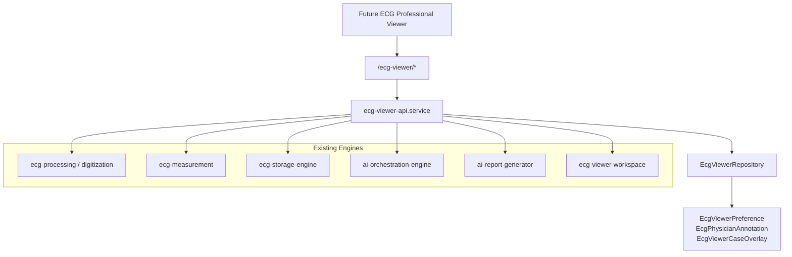

# Sprint 89 — ECG Viewer Backend API

**ECG Insight Enterprise — Production Mode**  
**Version:** `sprint89-ecg-viewer-v1`  
**Continues from:** Sprint 86 AI Orchestration Engine  
**Module:** `server/src/modules/ecg-viewer-api/`  
**Mount:** `/api/ecg-viewer`

---

## Executive Summary

Sprint 89 delivers a **unified backend API layer** for the future ECG Professional Viewer. The module composes existing clinical infrastructure (Sprint 82 processing, Sprint 85 storage, Sprint 86 AI orchestration) behind a single case-scoped facade — without any UI changes.

Legacy routes (`/ecg/*`, `/cases/*/ecg-viewer-workspace`) remain unchanged. New viewer clients should adopt `/ecg-viewer` as the canonical API surface.

---

## Architecture



---

## Module Structure

```
server/src/modules/ecg-viewer-api/
├── index.ts
├── types.ts
├── schemas.ts
├── repository.ts
├── ecg-viewer-api.service.ts
└── ecg-viewer-api.routes.ts
```

---

## API Endpoints

| Capability | Method | Route | Auth |
|------------|--------|-------|------|
| Health | `GET` | `/ecg-viewer/health` | Public |
| Zoom presets | `GET` | `/ecg-viewer/zoom-presets` | Public |
| Viewer bundle | `GET` | `/ecg-viewer/cases/:caseId/bundle` | Required |
| Original image | `GET` | `/ecg-viewer/cases/:caseId/image` | Required |
| Image metadata | `GET` | `/ecg-viewer/cases/:caseId/metadata` | Required |
| Measurements | `GET` | `/ecg-viewer/cases/:caseId/measurements` | Required |
| Save measurements | `PUT` | `/ecg-viewer/cases/:caseId/measurements` | Doctor |
| Waveform data | `GET` | `/ecg-viewer/cases/:caseId/waveform` | Required |
| Lead metadata | `GET` | `/ecg-viewer/cases/:caseId/leads` | Required |
| Annotations (AI + physician) | `GET` | `/ecg-viewer/cases/:caseId/annotations` | Required |
| Physician annotation create | `POST` | `/ecg-viewer/cases/:caseId/annotations` | Doctor |
| Physician annotation update | `PATCH` | `/ecg-viewer/cases/:caseId/annotations/:id` | Doctor |
| Physician annotation delete | `DELETE` | `/ecg-viewer/cases/:caseId/annotations/:id` | Doctor |
| Viewer preferences | `GET/PUT` | `/ecg-viewer/preferences` | Required |
| Overlay configuration | `GET/PUT` | `/ecg-viewer/cases/:caseId/overlay` | Doctor (PUT) |
| Comparison | `GET` | `/ecg-viewer/cases/:caseId/compare` | Required |
| Report | `POST` | `/ecg-viewer/cases/:caseId/report` | Doctor |
| Export | `POST` | `/ecg-viewer/cases/:caseId/export` | Doctor |

### Query parameters

| Endpoint | Params |
|----------|--------|
| Waveform | `?lead=II&maxSeconds=30` |
| Compare | `?baselineCaseId=<uuid>` |

### Export body

```json
{
  "format": "pdf|json|csv|png|svg|binary",
  "includeMeasurements": true,
  "includeAnnotations": true
}
```

---

## Feature Implementation

### Original ECG image
Delegates to latest `ECGFile` for case. Returns download URL, processed image URL, checksum, mime type.

### Image metadata
Unified DTO: acquisition info, digitization artifacts, OCR metadata, quality score, lead count.

### ECG measurements
Aggregates:
- `ECGMeasurement` (database)
- Clinical measurement engine (`measureCaseFromStoredLeads`)
- Digital ECG flat measurements
- Workspace caliper measurements (`CaseClinicalNote` workspace blob)

### Waveform data
Reads `ECGLeadSignal` with optional lead filter and `maxSeconds` truncation. Falls back to digitization pipeline leads.

### AI annotations
Sources:
- `ECGAnnotation` table (pipeline-detected)
- Digitization payload annotations
- Returned with `source: "ai"`

### Physician annotations
New `EcgPhysicianAnnotation` model with full CRUD. Geometry stored as JSON for calipers, markers, regions.

### Lead metadata
Per-lead: sampling rate, duration, paper speed, gain, sample count, `metadataJson`.

### Zoom presets
Server defaults: `[0.5, 1, 2, 4, 8, 16]`. User overrides via `EcgViewerPreference.zoomPresets`.

### Viewer preferences
`EcgViewerPreference` per user: default zoom, gain, paper speed, layout JSON, overlay defaults.

### Overlay configuration
`EcgViewerCaseOverlay` per case: AI findings visibility, grid, lead labels, measurement overlay, opacity, layers.

### Comparison
Measurement deltas between current case and optional `baselineCaseId`. Returns trend direction per metric.

### Report
Delegates to `ai-report-generator` (`generateClinicalReport` / `regenerateClinicalReport`).

### Export
Delegates to `exportDigitalEcg` for signal formats. PDF with measurements uses workspace export builder.

### Viewer bundle
`GET /cases/:caseId/bundle` — single payload for viewer bootstrap:
- image, metadata, measurements, leads, annotations, overlay
- Sprint 86 AI job status (`pending` / `completed` counts)

---

## Schema Changes

**Migration:** `20260709040000_sprint89_ecg_viewer_api`

| Model | Purpose |
|-------|---------|
| `EcgViewerPreference` | Per-user zoom, gain, paper speed, layout |
| `EcgPhysicianAnnotation` | Clinician-authored viewer annotations |
| `EcgViewerCaseOverlay` | Per-case overlay layer configuration |

---

## Integration with Prior Sprints

| Sprint | Integration |
|--------|-------------|
| **82** Processing | Waveform, metadata, AI annotations via `getDigitalEcg()` |
| **85** Storage | Image URLs via `ECGFile` download paths |
| **86** AI Orchestration | Bundle includes `aiJobStatus` from `AiOrchestrationJob` |
| **13** Workspace | Caliper measurements via `ecg-viewer-workspace.service` |

---

## Testing

```bash
npx tsx scripts/sprint89-ecg-viewer-api.test.ts
npx tsx scripts/sprint89-ecg-viewer-api.integration.ts
```

Pipeline entries in `scripts/integration/pipeline.mjs`.

---

## Validation Checklist

- [x] `npm run lint`
- [x] `npm run typecheck`
- [x] `npm run build`
- [x] Unit tests pass
- [x] Integration markers pass
- [ ] `GET /ecg-viewer/health` returns version
- [ ] `GET /ecg-viewer/cases/:id/bundle` returns aggregated payload
- [ ] Physician annotation CRUD persists to database

---

## Design Decisions

1. **Facade over rewrite** — Composes proven engines; no duplication of digitization or measurement logic.
2. **Backend only** — Zero UI/visual changes per sprint constraints.
3. **Incremental adoption** — Legacy routes untouched; viewer clients opt in via `/ecg-viewer`.
4. **Physician annotations** — New persistence layer; AI annotations remain pipeline-generated read-only.

---

*Sprint 89 — ECG Viewer Backend API — ECG Insight Enterprise*
