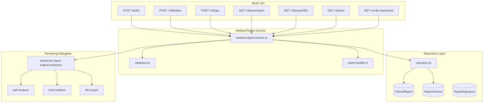

# Sprint 90 — Enterprise Medical Report Engine

**Version:** `sprint90-medical-report-v1`  
**Date:** 2026-07-09  
**API prefix:** `/api/medical-report-engine`  
**Mode:** Production

---

## Executive Summary

Sprint 90 delivers a **production Medical Report Engine** continuing from Sprint 86 AI orchestration. The engine provides structured draft-to-final report lifecycle management, AI findings integration, physician interpretation, measurements, impression, recommendations, electronic signature support, QR verification, report versioning, PDF generation architecture, print layout, JSON export, and FHIR-ready export.

The module uses clean architecture layers — **DTOs**, **validators**, **repositories**, and **services** — while delegating rendering to the proven `enterprise-report-engine` composer and exporters.

---

## Architecture



---

## Module Layout

```
server/src/modules/medical-report-engine/
├── types.ts                  # Engine version, section keys, PDF stages
├── dto.ts                    # MedicalReportDto, export DTOs, layout DTOs
├── schemas.ts                # Zod request validation
├── validators.ts             # Business rule validation
├── repository.ts             # Prisma repository layer
├── report-builder.ts         # ClinicalReport → MedicalReportDto
├── exporters.ts              # JSON, FHIR, print layout, PDF architecture
├── medical-report.service.ts # Orchestration services
├── medical-report.routes.ts  # REST endpoints
└── index.ts
```

---

## Supported Features

| Feature | Implementation |
|---------|----------------|
| Draft reports | `POST /drafts`, status `DRAFT` |
| Final reports | `POST /:reportId/finalize`, status `FINALIZED` |
| AI findings | `MedicalReportAiFindingsDto`, `aiFindings` field |
| Physician interpretation | `MedicalReportPhysicianDto` |
| Measurements | `MedicalReportMeasurementsDto` from `ecgMeasurements` |
| Impression | `finalPhysicianImpression` → `impression` |
| Recommendations | `recommendations[]` on report |
| Signature support | `POST /:reportId/sign`, `ReportSignature` lookup |
| QR verification | `GET /verify/:reportUuid?token=` |
| Report versioning | `ReportVersion` snapshots on each edit/finalize/sign |
| PDF generation architecture | `GET /:reportId/pdf-architecture` |
| Print layout | `GET /:reportId/print-layout`, `GET /:reportId/print` |
| Export JSON | `GET /:reportId/export/json` |
| Export FHIR-ready structure | `GET /:reportId/export/fhir` |

---

## Report Lifecycle

```
DRAFT → UNDER_REVIEW → FINALIZED → SIGNED → ARCHIVED
```

| Action | Endpoint | Role |
|--------|----------|------|
| Create draft | `POST /drafts` | DOCTOR |
| Update draft | `PATCH /:reportId` | Author |
| Submit review | `POST /:reportId/submit-review` | Author |
| Finalize | `POST /:reportId/finalize` | DOCTOR |
| Sign | `POST /:reportId/sign` | DOCTOR |

---

## PDF Generation Architecture

Six-stage pipeline exposed via `PdfArchitectureDto`:

1. **compose_document** — Load `ClinicalReport`, build `EnterpriseReportDocument`
2. **apply_print_layout** — Margins, watermark, section ordering (`PrintLayoutDto`)
3. **render_html** — Semantic HTML for browser print
4. **render_svg** — SVG intermediate for raster exports
5. **encode_pdf** — Vector PDF with verification footer
6. **persist_artifacts** — Store under `uploads/enterprise-reports/`

---

## QR Verification

Public endpoint (no auth):

```
GET /api/medical-report-engine/verify/:reportUuid?token=<verificationToken>
```

Returns integrity check via `contentHash` + `verificationHash` validation.

---

## DTO Structure

`MedicalReportDto` sections:

- `header` / patient context via nested fields
- `measurements` — ECG interval values
- `aiFindings` — diagnosis, confidence, model version
- `physicianInterpretation` — name, license, interpretation
- `impression` — final physician impression
- `recommendations` — clinical actions
- `signature` — pending/signed status
- `verification` — QR data, hashes, token, URL
- `versions` — version history

---

## Tests

| Script | Type |
|--------|------|
| `scripts/sprint90-medical-report-engine.test.ts` | Unit |
| `scripts/sprint90-medical-report-engine.integration.ts` | Integration markers |

---

## Validation

```bash
npm run lint
npm run typecheck
npm run build
npx tsx scripts/sprint90-medical-report-engine.test.ts
npx tsx scripts/sprint90-medical-report-engine.integration.ts
```

---

## Continuation from Sprint 86

Sprint 86 established durable **AI orchestration** producing `AIAnalysis` outputs. Sprint 90 completes the clinical documentation chain by turning case + AI outputs into **versioned, verifiable, exportable medical reports** with physician sign-off.

**Backend only — no frontend changes.**
