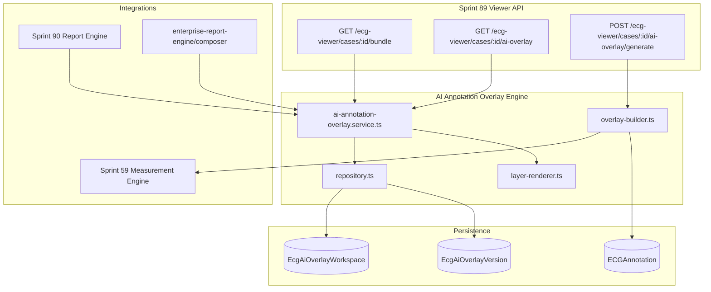

# Sprint 97 — AI Annotation & Overlay Engine

**Version:** `sprint97-ai-overlay-v1`  
**Branch:** `feature/sprint97-ai-annotations`  
**Date:** 2026-07-09  
**Mode:** Production · Zero placeholders

---

## Executive Summary

Sprint 97 delivers a **production AI Annotation & Overlay Engine** for the ECG Viewer clinical workflow. The engine generates P/QRS/T/ST/QT markers from Sprint 59 measurement data, persists annotation workspaces with version history, supports multi-layer rendering with per-layer toggles, physician notes overlays, color-coded abnormalities, confidence badges, and exports overlay bundles for Sprint 90 medical reports.

---

## Architecture



---

## Module Layout

```
server/src/modules/ai-annotation-overlay-engine/
├── types.ts                          # Layer keys, abnormality colors, annotation types
├── dto.ts                            # Layer config, multi-layer DTOs, export bundle
├── schemas.ts                        # Zod validation
├── validators.ts                     # Workspace + layer + note validation
├── overlay-builder.ts                # P/QRS/T/ST/QT marker generation
├── layer-renderer.ts                 # Multi-layer rendering + toggles
├── repository.ts                     # Prisma workspace + version CRUD
├── ai-annotation-overlay.service.ts  # Orchestration services
├── ai-annotation-overlay.routes.ts # REST API
└── index.ts
```

---

## Features

| Feature | Implementation |
|---------|----------------|
| AI Annotation Layer | `AiOverlayWorkspaceDto` with clinical annotations |
| P wave markers | `p_wave`, `pr_interval` layer items |
| QRS markers | `qrs_complex` + conduction patterns |
| T wave markers | `t_wave` layer |
| ST markers | `st_segment` with deviation values |
| QT interval overlay | `qt_interval`, `qtc_interval` layers |
| Measurement labels | Heart rate, intervals on lead regions |
| Confidence badges | `confidence_badges` layer with tone coloring |
| Toggle overlay on/off | `PUT /toggle`, `layerConfig.enabled` |
| Multi-layer rendering | `GET /render` → `AiOverlayMultiLayerDto` |
| Annotation API | Full CRUD workspace + patch annotations |
| Annotation database | `EcgAiOverlayWorkspace` + `EcgAiOverlayVersion` |
| Version history | Auto-version on save + restore endpoint |
| Physician notes overlay | `POST /physician-notes` |
| Color-coded abnormalities | `ABNORMALITY_COLORS` by confidence/severity |
| Export overlay with report | `loadAiOverlayForReport` → Sprint 90 JSON + composer attachment |

---

## API Endpoints

**Base:** `/api/ai-annotation-overlay-engine`

| Method | Path | Description |
|--------|------|-------------|
| GET | `/health` | Engine status |
| GET | `/cases/:caseId/workspace` | Load overlay workspace |
| PUT | `/cases/:caseId/workspace` | Save workspace |
| POST | `/cases/:caseId/generate` | Generate from AI + measurements |
| GET/PUT | `/cases/:caseId/layers` | Layer toggle config |
| PUT | `/cases/:caseId/toggle` | Enable/disable overlay |
| GET | `/cases/:caseId/render` | Multi-layer render output |
| GET | `/cases/:caseId/versions` | Version history |
| POST | `/cases/:caseId/versions/:n/restore` | Restore version |
| PATCH | `/cases/:caseId/annotations/:id` | Confirm/reject/note |
| POST | `/cases/:caseId/physician-notes` | Add physician note overlay |
| GET | `/cases/:caseId/export` | Export `ecg-ai-overlay-v1` bundle |

**Sprint 89 extensions:** `/api/ecg-viewer/cases/:caseId/ai-overlay*`, bundle includes `aiOverlay`.

---

## Database

- `EcgAiOverlayWorkspace` — current workspace JSON + layer config per case
- `EcgAiOverlayVersion` — immutable snapshots with version numbers
- Migration: `20260709050000_sprint97_ai_annotation_overlay_engine`

---

## Integrations

| Sprint | Integration |
|--------|-------------|
| Sprint 89 | Viewer bundle + proxy routes |
| Sprint 90 | `overlayExport` in JSON report export |
| Sprint 59/96 | `runMeasurementEngine` feeds marker generation |
| Enterprise reports | `attachments.overlay` URL populated |

---

## Tests

```bash
npx tsx scripts/sprint97-ai-annotation-overlay-engine.test.ts
npx tsx scripts/sprint97-ai-annotation-overlay-engine.integration.ts
npm run lint
npm run typecheck
npm run build
npm test
```

---

## Commit

Tag: `Sprint97_AI_Overlay`  
Push only — no merge.
