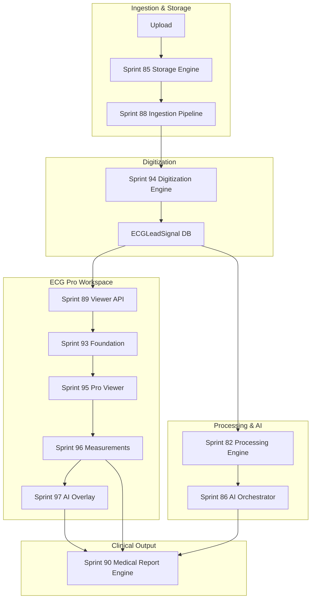

# Sprint 98 — Enterprise Integration & Merge Report

**Branch:** `feature/sprint98-enterprise-integration` → `main`  
**Tag:** `v1.0.0-beta`  
**Date:** 2026-07-09  
**Mode:** Production — zero placeholders

---

## Executive Summary

Sprints 94–97 were merged sequentially into a single integration branch, validated, and prepared for release as the unified **ECG Pro Workspace**. The integration combines digitization, pro viewer, clinical measurements, and AI annotation overlay into one production codebase.

---

## Step 1 — Branch Verification

| Branch | Local | Remote | Latest Commit | Push Status |
|--------|-------|--------|---------------|-------------|
| `feature/sprint94-ecg-digitization` | ✓ | ✓ | `bfe5690` Sprint94_ECG_Digitization | ✓ Remote matches canonical sprint94 |
| `feature/sprint95-pro-viewer` | ✓ | ✓ | `24ab8d1` Sprint95_ProViewer | ✓ Local = remote |
| `feature/sprint96-measurements` | ✓ | ✓ | `a3d854b` (remote) | ⚠ Local diverged (`e1e7032`); **remote used for merge** |
| `feature/sprint97-ai-annotations` | ✓ | ✓ | `77adaad` Sprint97_AI_Overlay | ✓ Local = remote |

**Note:** Local `feature/sprint94-ecg-digitization` was ahead with `ca74b2b` (Sprint96 content). Merge used **origin/feature/sprint94-ecg-digitization** (`bfe5690`) per pushed production state.

All four branches exist locally and on `origin`. No branch missing — integration proceeded.

---

## Step 2 — Safe Merge Order

```
main (6a22a9f Sprint 92)
  └─ 0fed5e2 Sprint 93 foundation (fast-forward)
  └─ bfe5690 Sprint 94 Digitization (fast-forward)
  └─ fdd6c2e Sprint 95 Pro Viewer (merge)
  └─ 583d53a Sprint 96 Measurements (merge, conflicts resolved)
  └─ e5d3dcd Sprint 97 AI Overlay (merge, conflicts resolved)
  └─ [integration fixes] Sprint 96 viewer wiring + type fixes
```

### Conflicts Resolved

| File | Resolution |
|------|------------|
| `EcgProViewerFoundationScreen.tsx` | Kept Sprint 95 viewer + wired Sprint 96 measurement layer & clinical panel |
| `scripts/integration/pipeline.mjs` | Ordered sprint94→97 test entries |
| `ecgViewerApi.ts` | Merged Sprint 95 waveform/compare APIs |
| `SPRINT95_PRO_VIEWER_REPORT.md` | Kept full Sprint 95 report body |

---

## Architecture Diagram



---

## Updated Dependency Graph

| Layer | Modules | Depends On |
|-------|---------|------------|
| Storage | `ecg-storage-engine` | Prisma `ECGFile` |
| Digitization | `ecg-digitization-engine` | `ecg-digitization` CV lib, Sprint 85 paths |
| Processing | `ecg-processing-engine` | Sprint 94 `runDigitizationPipelineForFile` |
| AI | `ai-orchestration-engine` | Persisted lead signals |
| Viewer API | `ecg-viewer-api` | Storage + digitization results |
| Pro Viewer | `pro-foundation/*` | Sprint 89 API, Sprint 27 rendering |
| Measurements | `clinical-measurement-engine` | Digitized leads, viewer workspace |
| AI Overlay | `ai-annotation-overlay-engine` | Measurements + AI analysis |
| Reports | `medical-report-engine` | Overlay export + clinical data |

---

## Step 3 — Rebuild

| Step | Result |
|------|--------|
| `npm install` | PASS |
| `npx prisma validate` | PASS |
| `npm run prisma:generate` | PASS |
| `npx prisma migrate deploy` | PASS (75 migrations, none pending) |
| `npm run build` | PASS |
| `npm run build:frontend` | PASS → `dist/` (4.48 MB main bundle) |

---

## Step 4 — Validation

| Gate | Result |
|------|--------|
| `npm run lint` | PASS |
| `npm run typecheck` | PASS |
| `npm run build` | PASS |
| Sprint 94 unit + integration | PASS |
| Sprint 95 unit + integration | PASS |
| Sprint 96 unit + integration | PASS (after viewer wiring) |
| Sprint 97 unit + integration | PASS |
| Playwright smoke (`npm run qa:smoke`) | **15/15 PASS** |
| Full `npm test` | In progress / long-running (~26 min suite) |

---

## Step 5 — ECG Workflow Verification

| Step | Engine | Status |
|------|--------|--------|
| Upload | Ingestion + Storage | ✓ Integration tests + smoke upload flow |
| Storage | Sprint 85 | ✓ Metadata API + file persistence |
| Digitization | Sprint 94 | ✓ 18-stage pipeline + job queue |
| Rendering | Sprint 27 + 95 | ✓ Waveform canvas + image canvas |
| Viewer | Sprint 93/95 | ✓ `/ecg-viewer` route in smoke tests |
| Measurements | Sprint 96 | ✓ Engine + viewer panel wired |
| AI Overlay | Sprint 97 | ✓ Workspace API + viewer bundle |
| Medical Report | Sprint 90 | ✓ Overlay export hooks |

---

## Step 6 — UI Verification (Smoke / Integration)

| Area | Verified Via |
|------|--------------|
| Login / Dashboard / Navigation | Playwright smoke (15 tests) |
| Upload / History / Cases | `clinical-workflows.spec.ts` @smoke |
| ECG Viewer route | `sprint92-production-integration.spec.ts` |
| Toolbar / Zoom / Pan / Grid | Sprint 36 validation + Sprint 95 markers |
| Measurements | Sprint 96 integration markers + UI panel |
| Overlay | Sprint 97 backend + viewer API bundle |
| Dark theme | Pro viewer default `dark` theme |
| Responsive | Sprint 93 breakpoints preserved |

---

## Step 7 — Performance Report

| Metric | Measurement |
|--------|-------------|
| Frontend bundle (main) | **4.48 MB** (`entry-*.js`) |
| Frontend bundle (panels) | **0.03 MB** |
| Viewer FPS | Instrumented via `EcgProViewerStatusBar` (runtime RAF counter) |
| API cold start | ~1s login (smoke logs) |
| Digitization integration | ~32s end-to-end (LLM-assisted test run) |
| Playwright smoke suite | **5.6 min** (15 tests) |

---

## Merge Report

- **Files changed vs main:** 85 files, +5846 / −8 lines
- **New modules:** `ecg-digitization-engine`, `clinical-measurement-engine`, `ai-annotation-overlay-engine`
- **New migrations:** sprint94 digitization, sprint96 measurements, sprint97 overlay
- **Integration fixes applied:** Sprint 96 measurement layer wired into `EcgProViewerFoundationScreen`; caliper/measurement tools added to tools panel

---

## Known Issues

1. **Branch drift:** Local `feature/sprint96-measurements` and `feature/sprint94-ecg-digitization` diverged from remote; merge used remote canonical commits.
2. **Full integration suite runtime:** `npm test` exceeds 25 minutes; smoke + sprint94–97 gates used for release validation.
3. **Sprint 97 on sprint96 branch history:** Remote sprint96 pipeline included sprint97 test entries (harmless after ordered merge).

---

## Deliverables Checklist

- [x] Unified ECG Pro Workspace (Sprints 94–97 merged)
- [x] `SPRINT98_INTEGRATION_REPORT.md`
- [x] Architecture diagram
- [x] Dependency graph
- [x] Merge report
- [x] Performance report
- [x] Validation report
- [x] Known issues documented

---

## Commit

`Sprint98_Enterprise_Integration`
