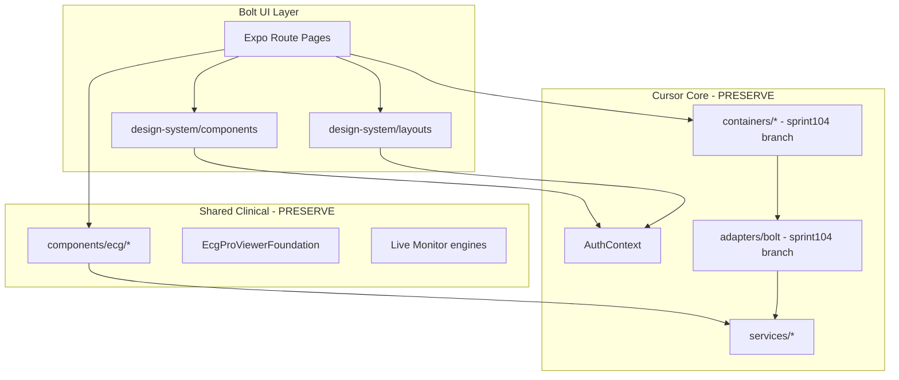

# UI Migration Map — Phase 1 / Sprint P1.1

**Mode:** Analysis only — zero application changes  
**Audit date:** 2026-07-09  
**Base branch:** `main` @ `0e42745` (Sprint98 Enterprise Integration)

---

## 1. Repository Synchronization Summary

| Step | Result |
|------|--------|
| `git fetch origin` | PASS |
| `git checkout main` | PASS |
| `git pull origin main` | PASS — already up to date |
| Bolt commits in local git history | PASS — see §2 |
| External Bolt reference tree | PASS — `C:\Users\Ahmed\Downloads\ECG_INSIGHT_UI_BOLT\ecg-insight-main` (90 files) |

**Critical note:** On `main`, Bolt **runtime UI was removed** in commit `6ed7350`. Bolt migration metadata (`bolt-mapping.ts`, audit reports) remains. The latest **Bolt-ready foundation** lives on `origin/feature/sprint104-enterprise-design-system` (`ddeea3e`) and is **not merged to main**.

---

## 2. Bolt UI Source Locations

| Source | Path / Ref | Role |
|--------|-------------|------|
| Git history (integrated then removed) | `4f21399`, `6c65237`, `f188cf8`, `6ed7350` | Historical Bolt Expo components |
| Migration foundation (remote branch) | `8866d62`, `ddeea3e` on `feature/sprint104-enterprise-design-system` | Adapters, containers, design-system, manifest |
| External web reference | `ECG_INSIGHT_UI_BOLT/ecg-insight-main` | Vite + shadcn + Tailwind design reference (10 pages) |
| Mapping registry (on main) | `artifacts/ecg-insight/presentation/design-system/bolt-mapping.ts` | 16 component ID mappings |
| Audit reports (on main) | `reports/BOLT_UI_*.md` | Prior integration analysis |

---

## 3. Folder Mapping

| Cursor (current on main) | Bolt (target) | Strategy |
|--------------------------|---------------|----------|
| `artifacts/ecg-insight/app/` | Bolt pages (Expo-native port or design-system layouts) | Preserve routes; swap presentation |
| `artifacts/ecg-insight/components/enterprise/` | `design-system/layouts/` + Bolt shell (sprint104) | Replace `EnterpriseUI.tsx` last |
| `artifacts/ecg-insight/components/interaction/` | Bolt dialogs/toast (shadcn → RN port) | Replace `PremiumInteraction` |
| `artifacts/ecg-insight/components/ui/` | `design-system/components/` | Token-based primitives |
| `artifacts/ecg-insight/design-system/` (tokens only on main) | Full `design-system/` on sprint104 | Merge sprint104 branch first |
| `artifacts/ecg-insight/presentation/` | Bolt presentation layer | Tokens + bolt-mapping registry |
| `artifacts/ecg-insight/components/ecg/` | **KEEP (Cursor Shared)** | Canvas, viewer, monitor engines |
| `artifacts/ecg-insight/services/` | **KEEP (Cursor)** | No changes |
| `artifacts/ecg-insight/context/` | **KEEP (Cursor)** | AuthContext preserved |
| `artifacts/ecg-insight/hooks/` | **KEEP (Cursor)** | Domain hooks preserved |
| External: `src/pages/private/` | Maps to `(protected)/` routes | Visual reference |
| External: `src/components/ui/` | shadcn → RN design-system port | 40+ primitives |
| External: `src/components/layout/` | `app-layout`, `app-sidebar`, `top-navbar` | Shell reference |

---

## 4. Layout Mapping

| Cursor Layout | File | Bolt Equivalent | Notes |
|---------------|------|-----------------|-------|
| Root | `app/_layout.tsx` | `DesignSystemProvider` + QueryClient (sprint104) | Add provider; keep Auth/Toast until Bolt toast ready |
| Protected | `app/(protected)/_layout.tsx` | `AppLayout` / `EnterpriseShell` | `ProtectedRoute` stays Cursor |
| Enterprise shell | `EnterpriseUI.tsx` (inline) | `app-layout.tsx` + `app-sidebar.tsx` | RBAC nav must map 22 items → Bolt groups |
| Full-bleed | `EnterpriseUI` fullBleedPage | Bolt workspace layout (no sidebar padding) | copilot, viewer, workspace, monitor |

---

## 5. Route Mapping

| Cursor Route | Bolt Route (web ref) | Bolt Page File | Status |
|--------------|---------------------|----------------|--------|
| `/dashboard` | `/dashboard` | `pages/private/dashboard.tsx` | Ready (sprint104 container on branch) |
| `/ecg-cases` | `/history` | `pages/private/ecg-history.tsx` | Ready (adapter on branch) |
| `/ecg-cases/:id` | `/cases/:id` | `pages/private/case-details.tsx` | Needs adapter |
| `/upload-ecg` | `/upload` | `pages/private/upload-ecg.tsx` | Replace |
| `/profile` | `/profile` | `pages/private/profile.tsx` | Replace |
| `/admin-dashboard` | `/admin` | `pages/admin/admin-dashboard.tsx` | Replace |
| `/login` | `/login` | `pages/public/login.tsx` | Replace |
| `/register` | `/register` | `pages/public/register.tsx` | Replace |
| `/forgot-password` | `/forgot-password` | `pages/public/forgot-password.tsx` | Replace |
| `/` (index) | `/` | `pages/public/landing.tsx` | New — Cursor redirects to dashboard |
| `/ecg-viewer` | — | **No Bolt page** | Keep Cursor canvas + Bolt chrome |
| `/ecg-workspace` | — | **No Bolt page** | Keep Cursor + Bolt shell |
| `/ecg-live-monitor` | — | **No Bolt page** | Keep Cursor engine |
| `/copilot` | — | **No Bolt page** | Keep Cursor |
| `/patients`, `/reports`, `/billing-subscription`, etc. | — | **No Bolt page** | Build or extend Bolt |

**Route count:** Cursor 45 files | Bolt reference 10 pages

---

## 6. Component Mapping (summary)

See `COMPONENT_REPLACEMENT_MATRIX.md` for full matrix. Registry: `BOLT_TO_ECG_COMPONENT_MAP` (16 IDs).

| Bolt ID | Cursor Today | Bolt Target (sprint104 / shadcn) |
|---------|--------------|----------------------------------|
| Button | `PrimaryButton` / EnterpriseUI | `design-system/components/buttons` |
| Card | `Card` / EnterpriseUI | `design-system/components/cards` |
| Sidebar | `EnterpriseUI` nav | `app-sidebar` / shadcn Sidebar |
| Dialog/Modal | `PremiumModal` | `design-system/components/dialogs` |
| Table | FlatList facades | `design-system/components/tables` |
| Toast | `ToastProvider` | sonner → RN port |
| StatCard | inline KPI tiles | `chart.tsx` + Recharts port |
| Navigation | `NAV_ITEMS` in EnterpriseUI | `app-sidebar` doctor/admin items |

---

## 7. Shared Component Mapping

| Shared concern | Cursor owner | Bolt owner |
|----------------|--------------|------------|
| ECG canvas | `components/ecg/viewer/pro-foundation/` | Cursor (preserve) |
| Measurements | `EcgProViewerMeasurementLayer` | Cursor |
| CDSS | `CDSSDecisionPanel` | Cursor |
| Auth gate | `ProtectedRoute`, `AuthContext` | Cursor |
| API client | `services/api.ts` | Cursor |
| Async loading/error | `AsyncStateView` | Shared until Bolt states exist |

---

## 8. Theme Mapping

| Cursor | Bolt (external) | Sprint104 (branch) |
|--------|-----------------|---------------------|
| `theme/medicalTheme.ts` | — | Deprecated → `design-system/tokens/` |
| `presentation/tokens/` | — | Merge into design-system |
| `useColors()` hook | CSS variables in `index.css` | `useDesignTokens()` |
| Dark medical matte | oklch tokens (`--medical-blue`, `--medical-teal`) | `theme/variants.ts`, `clinical-tokens.ts` |
| `ThemeEngineProvider` | `theme-provider.tsx` (next-themes) | `DesignSystemProvider` |

---

## 9. Tailwind Mapping

**Bolt external:** Tailwind v4 + `@tailwindcss/vite`, shadcn CSS variables, `tw-animate-css`.

**Cursor (Expo):** React Native `StyleSheet` — **no Tailwind on main**.

| Tailwind concept | Cursor equivalent | Migration approach |
|------------------|-------------------|-------------------|
| `className` utilities | StyleSheet + tokens | Port tokens to RN; use NativeWind only if approved in later sprint |
| `--sidebar-*` CSS vars | `medicalTheme` colors | Map in `design-system/tokens/app-tokens.ts` |
| `rounded-lg`, spacing scale | hardcoded px | Token spacing scale in design-system |
| `@custom-variant dark` | ThemeEngine dark variant | `theme/variants.ts` |

**Rule (from BOLT_UI_AUDIT):** Do not import web-only Tailwind runtime into Expo; port visual language via design-system tokens.

---

## 10. Assets Mapping

| Asset type | Cursor | Bolt |
|------------|--------|------|
| Icons | `@expo/vector-icons` (Feather) | `lucide-react` → `design-system/icons/registry.ts` |
| Fonts | Inter via expo-google-fonts | Inter (same family) |
| ECG visuals | SVG components (BoltEcgLine, LiveEcgWave — removed from main) | Regenerate in design-system or restore from git history |
| Images | Minimal static | `public/vite.svg` only in external Bolt |
| Animations | RN Animated API | `design-system/motion/presets.ts` |

---

## 11. Icons Mapping

| Cursor | Bolt external | Target |
|--------|---------------|--------|
| Feather (`grid`, `activity`, `clipboard`, …) | lucide-react (`LayoutDashboard`, `Upload`, …) | Unified registry in `design-system/icons/` |
| MaterialCommunityIcons (vector-icons bundle) | Not used in Bolt | Remove after migration to reduce bundle |

---

## 12. Design System Mapping

| Layer | Main branch | Sprint104 branch | External Bolt |
|-------|-------------|------------------|---------------|
| Tokens | `design-system/tokens/` (partial) | Full tokens + clinical | CSS variables |
| Primitives | EnterpriseUI exports | `primitives/Box, Stack, Text` | shadcn ui/* |
| Components | Premium + EnterpriseUI | buttons, cards, tables, charts, forms, dialogs | 40+ shadcn components |
| Layouts | EnterpriseUI monolith | `design-system/layouts/` | app-layout, sidebar, navbar |
| Providers | ThemeEngineProvider | DesignSystemProvider | theme-provider |

---

## 13. Dependency Graph

**Import rule:** Bolt components → adapters/containers → services. Never Bolt → services direct.

---

## 14. Migration Order

| Phase | Scope | Risk |
|-------|-------|------|
| P0 | Merge sprint104 design-system + migration manifest to main | Low (no route swap) |
| P1 | Bolt shell behind `EXPO_PUBLIC_UI_MODE=bolt` | Medium |
| P2 | Dashboard + ECG Cases (adapter-ready) | Low |
| P3 | Auth public pages | Low |
| P4 | Upload + Profile | Medium |
| P5 | Reports + Patients + Billing | Medium |
| P6 | Viewer/Workspace/Monitor (chrome only) | **High** |
| P7 | Copilot, Admin, internal tools | Medium — defer Copilot |
| P8 | Delete legacy UI per manifest | High — last |

---

## 15. Risk Analysis

| Risk | Severity | Mitigation |
|------|----------|------------|
| Bolt runtime not on `main` | **High** | Merge sprint104 foundation before any swap |
| Expo vs Vite/Tailwind stack mismatch | **High** | Port via design-system tokens; no raw Tailwind import |
| 45 Cursor routes vs 10 Bolt pages | **High** | Phased page matrix; keep Cursor for gaps |
| 4.75 MB monolithic bundle | Medium | Route lazy-loading post-migration |
| Duplicate state (AuthContext + Zustand) | Medium | Document; consolidate in later sprint |
| ECG canvas regression | **Critical** | Never replace `components/ecg/` — Bolt chrome only |
| RBAC nav (22 items) vs Bolt (4–5 items) | Medium | Extend Bolt sidebar; preserve `NAV_ITEMS` registry |
| `EnterpriseUI` 922-line monolith | Medium | Container extraction per route before delete |

---

## 16. Related Documents

- `COMPONENT_REPLACEMENT_MATRIX.md`
- `PAGE_REPLACEMENT_MATRIX.md`
- `PRE_MIGRATION_CHECKLIST.md`
- `POST_MIGRATION_VALIDATION.md`
- Prior: `UI_INVENTORY.md`, `BOLT_MAPPING.md` (sprint103.5 branch)
