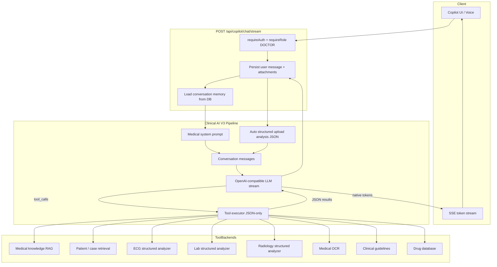

# Clinical AI Assistant V3 Architecture

ECG Insight Enterprise replaces the rule-based Copilot V2 pipeline with an **LLM-first** medical assistant. The language model generates **100% of user-facing prose**. Tools return **JSON only**.

## System diagram

## Request flow

1. User sends text or voice transcript (voice uses the same endpoint after STT).
2. Server loads the last 24 turns from `CopilotMessage` records.
3. Uploads are analyzed into **structured JSON** (ECG / lab / radiology pipelines) and injected as context for the LLM — not as canned answers.
4. The LLM streams tokens directly from the provider (`AI_MODEL_API_KEY` / `COPILOT_LLM_MODEL`).
5. When the model requests tools, the server executes them, returns JSON, and the model continues until a final natural answer is streamed.
6. The assistant message is persisted once generation completes.

## Removed from the active path

| Legacy component | Status |
|------------------|--------|
| `engine/v2/pipeline.ts` | Bypassed — not called |
| `NaturalResponse.generate` | Not wired |
| `MedicalReasoning` / `ConversationIntentEngine` | Not wired |
| `StreamingRenderer` fake chunking | Removed from chat stream |
| `previewClinicalCopilotEngine` full duplicate run | Replaced with lightweight stub |
| Rule-based greeting/education composers | Not used |

Legacy files remain in the repo for reference but **do not generate chat answers**.

## Configuration

| Variable | Purpose |
|----------|---------|
| `AI_MODEL_API_KEY` | OpenAI API key (chat + Whisper) |
| `COPILOT_LLM_MODEL` | Model id (default `gpt-4o-mini`) |
| `COPILOT_LLM_BASE_URL` | Optional OpenAI-compatible base URL |
| `COPILOT_LLM_MOCK` | `true` in CI/tests when no API key |

## 30 conversational validation scenarios

These scenarios are exercised in `scripts/copilot-clinical-ai-v3.integration.ts`. With `COPILOT_LLM_MOCK=true`, the mock LLM returns natural multi-sentence replies; with a live key, OpenAI generates fully contextual answers.

| # | User message | Expected behavior |
|---|--------------|-------------------|
| 1 | Hello | Warm professional greeting |
| 2 | How are you? | Conversational small talk |
| 3 | I'm a medical student | Remembers learner persona |
| 4 | Teach me ECG | Tutor mode — structured learning offer |
| 5 | Where should I start? | Progressive education, fundamentals first |
| 6 | What is hypertension? | Clear medical explanation |
| 7 | How is it diagnosed? | Follow-up — understands prior hypertension topic |
| 8 | What causes LVH? | Physiology linked to prior context when relevant |
| 9 | Explain atrial fibrillation | Natural cardiology teaching |
| 10 | AF | Stays on atrial fibrillation, not unrelated syndromes |
| 11 | What drugs treat hypertension? | Pharmacology discussion |
| 12 | Is amiodarone safe with warfarin? | Drug interaction reasoning |
| 13 | Patient has chest pain and diaphoresis | Emergency-aware clinical tone |
| 14 | This patient has hypertension | Clinical case framing |
| 15 | Why is his LVH happening? | Pronoun/case continuity |
| 16 | What would you do next? | Next-step clinical reasoning |
| 17 | Interpret this ECG | Requests context or uses uploaded tracing JSON |
| 18 | Review the lab I uploaded | Grounds answer in structured lab JSON |
| 19 | What does ESC recommend for AF anticoagulation? | Guideline-oriented answer via tool + LLM |
| 20 | Generate a differential for syncope | Differential diagnosis discussion |
| 21 | Thank you | Graceful acknowledgment |
| 22 | Continue | Continues prior thread |
| 23 | Tell me more | Expands previous topic |
| 24 | What about the QT interval? | ECG/conduction focus |
| 25 | Explain STEMI | Acute coronary syndrome teaching |
| 26 | How do you manage hyperkalemia on ECG? | ECG + electrolyte integration |
| 27 | Summarize our conversation | Uses full thread memory |
| 28 | Who are you? | Assistant identity, no internal metadata |
| 29 | I need your help | Supportive clinical colleague tone |
| 30 | Goodbye | Natural closing |

## Key files

| Path | Role |
|------|------|
| `server/src/modules/copilot/v3/pipeline.ts` | V3 orchestration |
| `server/src/modules/copilot/v3/llm-provider.ts` | Streaming LLM + tool loop |
| `server/src/modules/copilot/v3/system-prompt.ts` | Production medical system prompt |
| `server/src/modules/copilot/v3/tools/executor.ts` | JSON tool execution |
| `server/src/modules/copilot/v3/tools/document-analyzer.ts` | ECG / lab / radiology structured JSON |
| `server/src/modules/copilot/engine/clinical-ai-engine.ts` | Public entry → V3 only |
| `server/src/modules/copilot/copilot.routes.ts` | HTTP + real SSE streaming |
