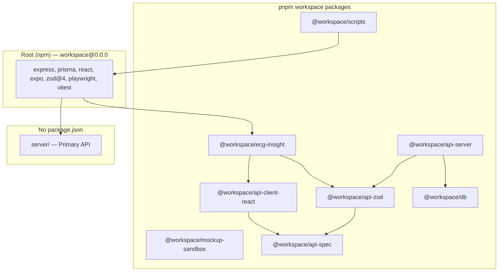
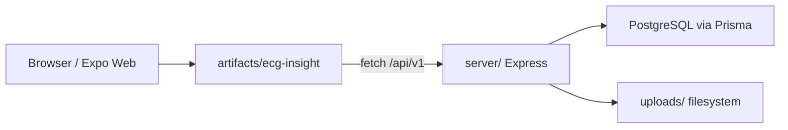
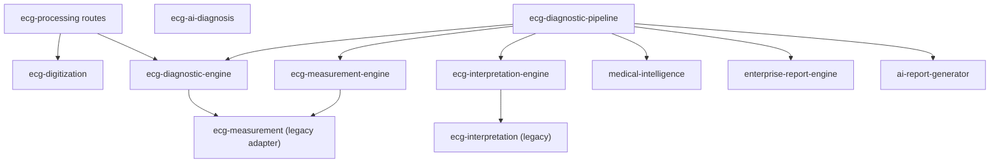
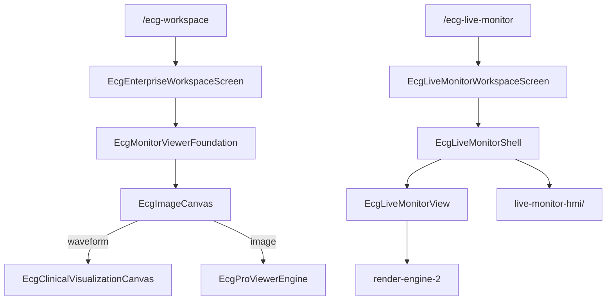

# 06 — Dependency Graph

**Audit:** Sprint 69 | Read-only

---

## Package Dependency Graph



---

## Runtime Dependency Flow (Production)



---

## ECG Clinical Pipeline (Server)



---

## Frontend Viewer Dependency Graph



---

## Cross-Module Import Hotspots

| Module | Imported By (count) | Role |
|--------|---------------------|------|
| `ecg-diagnostic-engine` | measurement, pipeline, processing | Core signal analysis |
| `ecg-processing` routes | Frontend `ecgProcessing.ts` | HTTP facade |
| `medical-intelligence` | pipeline, frontend MI service | AI orchestration |
| `clinical-knowledge-engine` | interpretation-engine bridge | Diagnosis catalog |
| `render-engine-2` | hospital-monitor, live monitor view | Realtime waveform |
| `live-monitor-hmi` | EcgLiveMonitorShell | Hospital chrome |

---

## External Dependencies (Key)

| Package | Version | Used By | Risk |
|---------|---------|---------|------|
| `express` | ^5.2.1 | server, api-server | Low |
| `@prisma/client` | ^7.4.2 | server | Low |
| `zod` | ^4.4.3 (root) / ^3.25 (catalog) | server vs lib | **High** |
| `react` | ^19.1.0 | ecg-insight | Low |
| `expo` | ~54.x | ecg-insight | Medium (upgrade cadence) |
| `playwright` | ^1.61.1 | tests | Low |
| `vitest` | ^3.x | unit tests | Low |
| `argon2` + `bcryptjs` | both present | auth crypto | Medium (consolidate) |

---

## Orphan Dependency Nodes (No Upstream Consumers)

| Node | Status |
|------|--------|
| `EcgLiveMonitorGridShell` | No importers |
| `EcgReadingStationLayout` | No importers |
| `EcgRenderingEngineView` | No importers |
| `enterprise/emkp/*` | Test-only |
| `artifacts/api-server` | Not in production CI path |
| `lib/integrations/*` | Missing directory |

---

## CI Dependency Chain

```
npm ci
  → prisma:generate
  → npm run typecheck (server + ecg-insight)
  → npm run lint (scoped)
  → vitest (narrow coverage)
  → scripts/integration/pipeline.mjs (145 scripts sequential)
  → playwright (1 worker, global-setup starts servers)
```

**Bottleneck:** Sequential integration pipeline + single Playwright worker.

---

## Recommended Dependency Simplification

1. Move `server/` into pnpm workspace OR remove pnpm workspace entirely.
2. Unify Zod to v4 across all packages.
3. Archive Drizzle subgraph (`lib/db`, `api-server`) if unused in production.
4. Prune barrel exports in `viewer/index.ts` to reflect actual graph.
5. Document canonical import paths in `ARCHITECTURE.md`.

---

*Read-only dependency analysis.*
