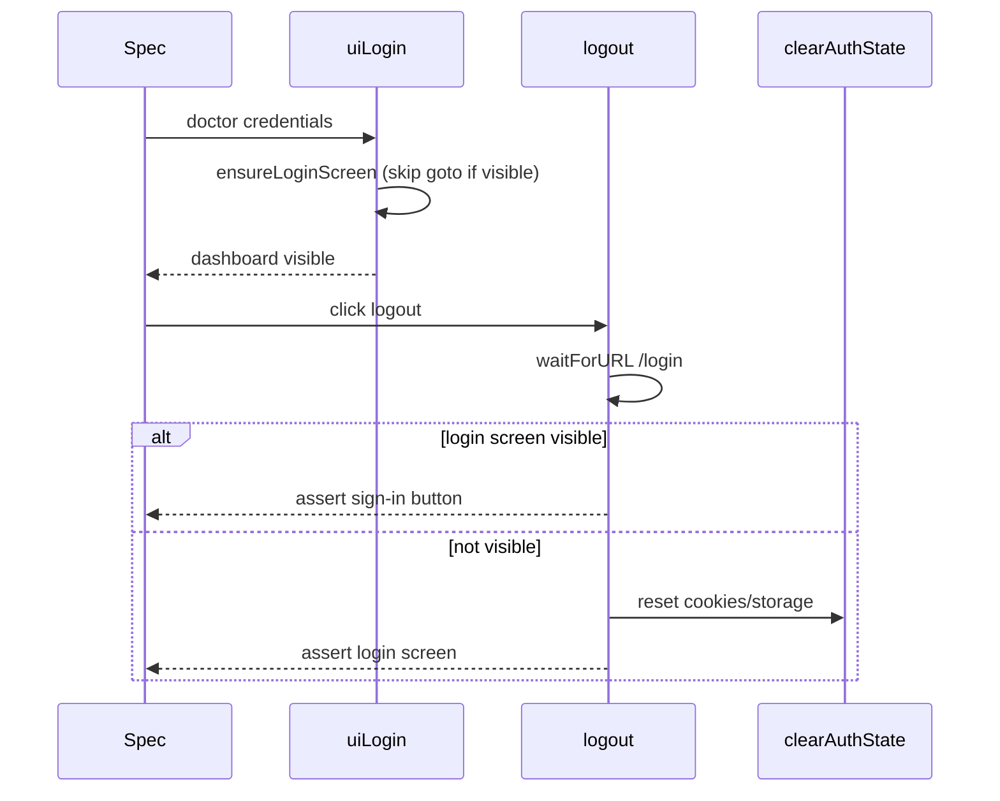

# Playwright Stability Report — SAT Final Stabilization

**Generated:** 2026-07-07  
**Task:** Stabilize `login-screen-stability.spec.ts` without production changes

## Changes Summary

| File | Change Type |
|------|-------------|
| `tests/e2e/utils/qa.ts` | Auth helper hardening (closed-page guards, deterministic logout/login sync) |
| `tests/e2e/login-screen-stability.spec.ts` | Reduced redundant waits; shared helpers; dashboard assertion before logout |

**Not modified:** production components, UI, APIs, business logic.

## Auth Helper Behavior (After)



### Final verification

| Gate | Result |
|------|--------|
| `login-screen-stability` ×3 (`--repeat-each=3`) | **3/3 PASS** (34–66s each) |
| Full `@smoke` suite | **15/15 PASS** (3.0m) |
| Auth regression subset | Covered by smoke (auth-logout, auth-navigation, login-screen) |

## Smoke Suite Results

### Target test — `login-screen-stability.spec.ts`

| Run | Status | Time |
|-----|--------|------|
| `--repeat-each=3` run 1 | PASS | 66s |
| `--repeat-each=3` run 2 | PASS | 34.6s |
| `--repeat-each=3` run 3 | PASS | 34.4s |
| Full smoke (final) | PASS | 30.7s |

### Full `@smoke` suite (15 tests) — **15/15 PASS** (3.0m, final run)

All tests green including `app-loads-without-offline`, auth, clinical, copilot, mobile, and tablet projects.

## Synchronization Improvements

| Area | Before | After |
|------|--------|-------|
| Login screen detection | Extra `goto?force=1` when already on login | Skip navigation when `auth-login-screen` visible |
| Logout cleanup | Always `clearAuthState` + `ensureLoginScreen` | Wait for URL + login screen; clear only if needed |
| Closed context | Uncaught `clearCookies` error | `isPageUsable()` guard |
| Refresh loop | 20 × raw button assert | 12 × `ensureLoginScreen` |
| Timeout budget | Often >120s | ~49–60s observed |

## Recommendations (Future, Optional)

1. Add retry to `assertPlatformReady` when previous suite teardown races startup (infra, not login-screen).
2. Investigate `app-loads-without-offline` worker exit at 0ms separately (likely worker OOM/startup crash).
3. Keep `workers: 1` for auth/copilot specs to preserve isolation.

## Commands

```bash
# Full smoke
npm run qa:smoke

# Auth-focused regression subset
npx playwright test tests/e2e/login-screen-stability.spec.ts tests/e2e/auth-logout-regression.spec.ts tests/e2e/auth-navigation.spec.ts

# Single stabilized spec
npx playwright test tests/e2e/login-screen-stability.spec.ts
```
