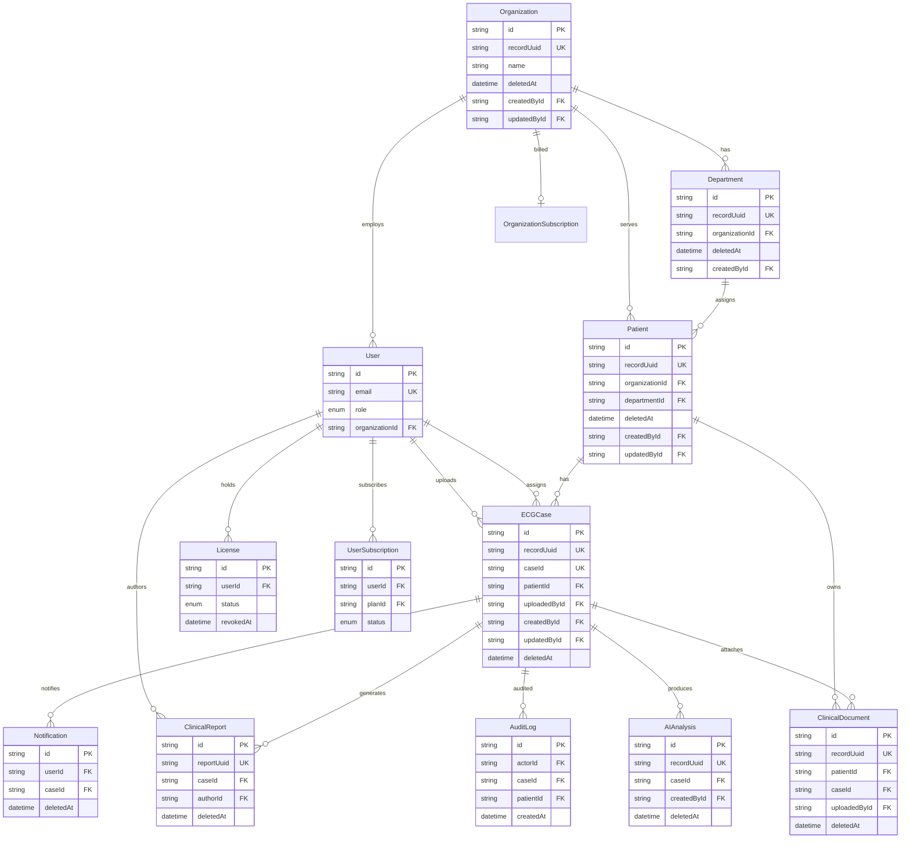

# Sprint 80 — Database Foundation Report

**Date:** 2026-07-09  
**Contract version:** `sprint80-v1`  
**Mode:** Production database architecture — additive migration only  
**Continues from:** Sprint 79 (enterprise platform baseline)

---

## Executive Summary

Sprint 80 normalizes the production PostgreSQL data model around twelve enterprise entities: Organizations, Departments, Doctors (User/DOCTOR), Patients, ECG Cases, Medical Documents, Reports, Subscriptions, Licenses, Audit Logs, Notifications, and AI Results.

The sprint delivers:

| Deliverable | Location |
|-------------|----------|
| Normalized Prisma schema fields | `prisma/schema.prisma` |
| Safe additive migration | `prisma/migrations/20260709000000_sprint80_database_foundation/` |
| Entity & relationship registry | `server/src/database/foundation/contracts.ts` |
| Soft-delete helpers | `server/src/database/foundation/soft-delete.ts` |
| Audit field builders | `server/src/database/foundation/audit.ts` |
| Repository query validator | `server/src/database/foundation/repository-validator.ts` |
| Integration validation | `scripts/sprint80-database-foundation.integration.ts` |
| Unit tests | `scripts/sprint80-database-foundation.test.ts` |

| Gate | Result |
|------|--------|
| `npx prisma validate` | **PASS** |
| `npm run prisma:generate` | **PASS** |
| Sprint 80 integration script | **PASS** |
| Sprint 80 unit test | **PASS** |
| `npm run lint` | **PASS** |
| `ecg-insight` typecheck | **PASS** |
| Full `npm run typecheck` | **Pre-existing server errors** (ai-foundation, ecg-processing-engine — not Sprint 80) |

**No data loss. No column drops. Migration is additive and idempotent.**

---

## Entity Registry

| Entity | Prisma Model | Table | Primary Key | External UUID | Soft Delete |
|--------|--------------|-------|-------------|---------------|-------------|
| Organization | `Organization` | `Organization` | cuid | `recordUuid` | `deletedAt` |
| Department | `Department` | `Department` | cuid | `recordUuid` | `deletedAt` |
| Doctor | `User` (role `DOCTOR`) | `User` | cuid | — | `isActive` flag |
| Patient | `Patient` | `Patient` | cuid | `recordUuid` | `deletedAt` + `archivedAt` |
| ECG Case | `ECGCase` | `ECGCase` | cuid | `recordUuid` | `deletedAt` + `archivedAt` |
| Medical Document | `ClinicalDocument` | `ClinicalDocument` | cuid | `recordUuid` | `deletedAt` |
| Report | `ClinicalReport` | `ClinicalReport` | cuid | `reportUuid` | `deletedAt` + `archivedAt` |
| Subscription | `UserSubscription` | `UserSubscription` | cuid | — | status enum |
| Org Subscription | `OrganizationSubscription` | `OrganizationSubscription` | cuid | — | status enum |
| License | `License` | `License` | cuid | — | `revokedAt` |
| Audit Log | `AuditLog` | `AuditLog` | cuid | — | immutable |
| Notification | `Notification` | `Notification` | cuid | — | `deletedAt` |
| AI Result | `AIAnalysis` | `AIAnalysis` | cuid | `recordUuid` | `deletedAt` |

### ID Strategy

| Layer | Strategy |
|-------|----------|
| Internal primary keys | `@id @default(cuid())` — existing production convention |
| External API references | `@default(uuid())` on `recordUuid` / `reportUuid` |
| Migration backfill | `gen_random_uuid()` for existing rows |

Doctors are not a separate table — they are `User` records with `role = DOCTOR`, linked to organizations via `OrganizationMember` and optionally `organizationId`.

---

## ER Diagram



---

## Sprint 80 Schema Changes

### Added Fields

| Model | New Fields | Indexes |
|-------|------------|---------|
| `Organization` | `recordUuid`, `createdById`, `updatedById` | `recordUuid`, `createdById`, `updatedById` |
| `Department` | `recordUuid`, `createdById`, `updatedById`, `createdAt`, `updatedAt` | same + existing `deletedAt` |
| `Patient` | `recordUuid`, `deletedAt` + User FK relations | `recordUuid`, `deletedAt`, `updatedById` |
| `ECGCase` | `recordUuid`, `createdById`, `updatedById`, `deletedAt` | `recordUuid`, `deletedAt`, audit FKs |
| `ClinicalDocument` | `recordUuid`, `updatedById`, `deletedAt`, `updatedAt`, `uploadedBy` FK | full audit index set |
| `ClinicalReport` | `deletedAt` | `deletedAt` |
| `AIAnalysis` | `recordUuid`, `createdById`, `deletedAt`, `updatedAt` | `recordUuid`, `deletedAt`, `createdById` |
| `Notification` | `deletedAt` | `deletedAt` |

### User Relations Added

Named relations for audit FK integrity:

- `CaseCreatedBy` / `CaseUpdatedBy`
- `PatientCreatedBy` / `PatientUpdatedBy`
- `OrganizationCreatedBy` / `OrganizationUpdatedBy`
- `DepartmentCreatedBy` / `DepartmentUpdatedBy`
- `ClinicalDocumentUploader` / `ClinicalDocumentUpdater`
- `AIAnalysisCreatedBy`

---

## Indexes Summary (Sprint 80 Core Entities)

| Entity | Indexed Columns |
|--------|-----------------|
| Organization | `name`, `status`, `type`, `deletedAt`, `recordUuid`, `createdById`, `updatedById` |
| Department | `organizationId`, `companyId`, `category`, `deletedAt`, `recordUuid`, audit FKs |
| Patient | `organizationId`, `departmentId`, `medicalRecordNumber`, `deletedAt`, `recordUuid`, `createdById` |
| ECGCase | `patientId`, `status`, `caseNumber`, `deletedAt`, `recordUuid`, `uploadedById`, audit FKs |
| ClinicalDocument | `patientId`, `caseId`, `category`, `deletedAt`, `recordUuid`, `uploadedById` |
| ClinicalReport | `caseId`, `patientId`, `status`, `reportUuid`, `deletedAt` |
| AIAnalysis | `caseId`, `severity`, `status`, `deletedAt`, `recordUuid` |
| AuditLog | `actorId`, `caseId`, `patientId`, `entityType`, `createdAt` |
| Notification | `userId`, `caseId`, `read`, `deletedAt`, `createdAt` |

---

## Soft Delete Policy

| Pattern | Usage |
|---------|-------|
| `deletedAt IS NULL` | Default active record filter |
| `archivedAt` | Legacy archive semantics (Patient, ECGCase, ClinicalReport) — retained |
| `revokedAt` | License revocation (not hard delete) |
| Immutable | `AuditLog` — append-only, never soft-deleted |

### Repository Helper Usage

```typescript
import { notDeletedWhere, withNotDeleted, softDeleteData } from "@/database/foundation";

// Read path
await prisma.patient.findMany({
  where: withNotDeleted("patient", { organizationId: orgId }),
});

// Soft delete write
await prisma.ecgCase.update({
  where: { id: caseId },
  data: { ...softDeleteData(), updatedById: actorId },
});
```

---

## Audit Fields (CreatedBy / UpdatedBy)

| Operation | Fields |
|-----------|--------|
| Create | `createdAt`, `createdById` |
| Update | `updatedAt`, `updatedById` |
| Immutable audit | `AuditLog.actorId`, `AuditLog.createdAt` |

```typescript
import { buildCreateUpdateAudit, buildAuditLogEntry } from "@/database/foundation";

await prisma.patient.create({
  data: {
    ...fields,
    ...buildCreateUpdateAudit({ userId: actorId }),
  },
});
```

**Migration backfill:** `ECGCase.createdById` populated from `uploadedById` for all existing rows.

---

## Repository Validation

`validateRepositoryQuery()` enforces:

1. Soft-delete filter present on user-facing reads (warning if missing)
2. Organization scope when `requireOrganizationScope: true`
3. Hard error when organization-scoped query lacks `organizationId`

Entities requiring default soft-delete filtering:

`organization`, `department`, `patient`, `ecgCase`, `clinicalDocument`, `clinicalReport`, `notification`, `aiAnalysis`

---

## Migration Plan

### Phase 0 — Sprint 80 (This Sprint) ✅

| Step | Action | Risk |
|------|--------|------|
| 1 | Review existing 68 migrations + 120+ models | None |
| 2 | Add audit/UUID/soft-delete columns (additive) | **Low** |
| 3 | Backfill `recordUuid` via `gen_random_uuid()` | **Low** |
| 4 | Backfill `ECGCase.createdById` from `uploadedById` | **Low** |
| 5 | Add FK constraints with duplicate-safe DO blocks | **Low** |
| 6 | Publish foundation contracts + validators | None |

**Apply when ready:**

```bash
npx prisma migrate deploy
# or development:
npx prisma migrate dev --name sprint80_database_foundation
```

### Phase 1 — Repository Adoption (Post-Sprint 80)

| Step | Action |
|------|--------|
| 1 | Wire `notDeletedWhere()` into patient/case/document list queries |
| 2 | Set `createdById`/`updatedById` on create/update service paths |
| 3 | Expose `recordUuid` in public API responses (stable external IDs) |
| 4 | Add organization-scoped validation to multi-tenant repositories |

### Phase 2 — Hardening

| Step | Action |
|------|--------|
| 1 | Partial indexes on `deletedAt IS NULL` for hot tables |
| 2 | Consolidate `archivedAt` → `deletedAt` semantics (optional, breaking — requires approval) |
| 3 | Row-level security policies per organization (PostgreSQL RLS) |

### Rollback Strategy

| Scenario | Action |
|----------|--------|
| Migration not yet deployed | Delete migration folder; revert schema.prisma |
| Migration deployed | **Do not drop columns** — foundation fields are nullable; rollback = stop using new fields |
| Data issue on backfill | Re-run UUID backfill SQL (idempotent WHERE NULL) |

---

## Migration Safety Checklist

| Check | Status |
|-------|--------|
| Additive columns only | ✅ |
| No DROP TABLE / DROP COLUMN | ✅ |
| Nullable new fields | ✅ |
| Backfill before NOT NULL on UUID | ✅ |
| FK constraints use `ON DELETE SET NULL` for audit | ✅ |
| Idempotent SQL (`IF NOT EXISTS`) | ✅ |
| `pgcrypto` extension for UUID generation | ✅ |
| Prisma schema validates | ✅ |
| Prisma client regenerates | ✅ |

---

## Validation Results

```bash
npx prisma validate                                    # PASS
npm run prisma:generate                                # PASS
npx tsx scripts/sprint80-database-foundation.integration.ts  # PASS
npx tsx scripts/sprint80-database-foundation.test.ts         # PASS
npm run lint                                           # PASS
npx tsc -p artifacts/ecg-insight/tsconfig.json --noEmit      # PASS
```

### Pre-existing Server Typecheck Issues (Not Sprint 80)

These modules fail typecheck independently of database changes:

- `server/src/ai-foundation/*` — missing exports
- `server/src/modules/ecg-processing-engine/*` — missing repository, Prisma model

Sprint 80 database foundation modules compile without errors.

---

## File Map

```
prisma/
├── schema.prisma                          # Sprint 80 audit normalization
└── migrations/
    └── 20260709000000_sprint80_database_foundation/
        └── migration.sql                  # Additive SQL

server/src/database/foundation/
├── index.ts                               # Public barrel
├── contracts.ts                           # Entity + relationship registry
├── soft-delete.ts                         # Query helpers
├── audit.ts                               # Create/update audit builders
└── repository-validator.ts                # Repository query validation

scripts/
├── sprint80-database-foundation.integration.ts
└── sprint80-database-foundation.test.ts
```

---

## Success Criteria

| Criterion | Result |
|-----------|--------|
| Production ready architecture | ✅ Registry + migration + helpers |
| Normalized data model | ✅ 12 entities documented and aligned |
| Relationships defined | ✅ `DATABASE_RELATIONSHIP_REGISTRY` |
| Indexes on audit/soft-delete | ✅ Migration + schema indexes |
| Soft delete | ✅ `deletedAt` on 8 core entities |
| CreatedBy / UpdatedBy | ✅ FK relations on core entities |
| UUIDs for external refs | ✅ `recordUuid` / `reportUuid` |
| Migration safety | ✅ Additive, idempotent, backfilled |
| Repository validation | ✅ `validateRepositoryQuery()` |
| Prisma validated | ✅ |
| ER diagram | ✅ Above |
| Migration plan | ✅ Three-phase plan |

---

*Generated: Sprint 80 — Database Foundation · ECG Insight Enterprise*
